<div align="center">

简体中文 | [English](README.EN.md)

[](https://starsl.cn)
[](https://cassinfra.github.io/KubeDoor/)
[](https://github.com/CassInfra/KubeDoor/commits/main)
[](https://github.com/CassInfra/KubeDoor/issues)
[](https://www.python.org)
[](https://vuejs.org)
[](https://www.postgresql.org)
[](https://kubernetes.io)
[](LICENSE.txt)


# 花折 - KubeDoor

花开堪折直须折🌻莫待无花空折枝

**AI 驱动的多 K8S 集群智能管控平台**

[官网](https://cassinfra.github.io/KubeDoor/) · [快速部署](#快速部署) · [文档](#文档) · [交流群](#kubedoor交流群与赞赏)

</div>

---
**国内用户如果访问图片异常，可以访问Gitee同步站：<a target="_blank" href="https://gitee.com/starsl/KubeDoor">https://gitee.com/starsl/KubeDoor</a>**

## 🏷目录
* [🌈概述](#概述)
* [🎉2.x新特性](#2x新特性)
* [💠架构](#架构)
* [💎功能](#功能)
  * [🤖AI助手与MCP](#1-ai助手与mcp)
  * [📡多集群监控](#2-多集群监控)
  * [🎛K8S资源管理](#3-k8s资源管理)
  * [🧬告警、事件与屏蔽](#4-告警事件与屏蔽)
  * [🚧高峰期资源与准入管控](#5-高峰期资源与准入管控)
  * [☕JVM管控与诊断](#6-jvm管控与诊断)
  * [⚖节点均衡与弹性调度](#7-节点均衡与弹性调度)
  * [🌐Istio路由管理（试用）](#8-istio路由管理试用)
  * [🔐平台与权限](#9-平台与权限)
* [🚀快速部署](#快速部署)
* [♻升级说明](#升级说明)
* [📚文档](#文档)
* [🔔交流群与赞赏](#kubedoor交流群与赞赏)
* [🙇贡献者](#贡献者)
* [🥰鸣谢](#鸣谢)

---

## 🌈概述

🌼**花折 - KubeDoor** 是一个使用Python + Vue开发的**AI驱动的多K8S集群智能管控平台**：控制端装一套、每个业务集群装一个agent，就能在一个Web里完成多集群的监控、资源管理、告警与事件、高峰期资源治理、JVM管控和节点均衡；同时内置**可审批、可审计的AI运维助手**，并以**标准MCP**对外开放。

KubeDoor专注微服务每日高峰时段的资源视角：采集各微服务高峰期的真实资源用量，基于K8S准入控制让资源需求值与真实用量保持一致。2.x在此基础上把AI助手作为核心能力，并把数据库统一为PostgreSQL、把部署简化为一个脚本。

- 🤖**AI运维助手**：用自然语言排障、查询和变更；自动调用63个KubeDoor业务操作与K8S API、kubectl、istioctl等通用工具，查询自动执行，变更先展示参数与差异，人工批准后才执行。
- 🌐**多集群统一纳管**：agent主动外连控制端，业务集群无需开放入站端口；所有集群的资源、指标、事件和告警集中在一个平台。
- 🎯**高峰期资源治理**：按业务高峰时段采集资源数据，通过准入控制统一管控副本数、需求值、限制值和JVM启动参数。
- 🔔**告警闭环**：指标告警、K8S事件告警与告警屏蔽，通知推送到企业微信、钉钉、飞书、Slack。
- 🚀**部署简单**：一个脚本 + 一份配置文件，PostgreSQL是唯一的数据库。

<div align="center">

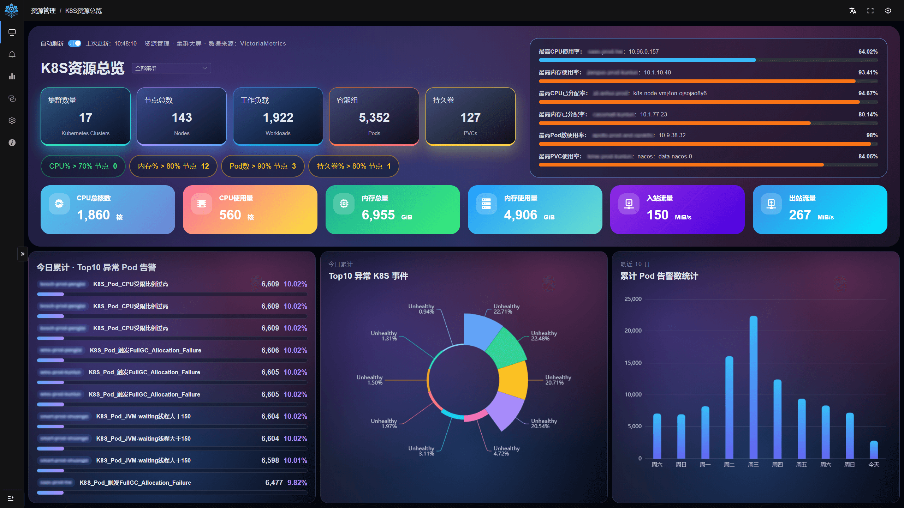

K8S资源总览：多集群资源、风险节点、今日异常告警与事件，一屏尽览

</div>

---

## 🎉2.x新特性

**相对1.7，2.x是一次架构级升级：AI助手成为核心能力，PostgreSQL成为唯一数据库，部署改为一个脚本。** 当前版本为2.1.0，下文【2.0】/【2.1】表示首次提供该能力的版本。

**🤖AI**
- 【2.1】**内置AI助手**（kubedoor-ai，随控制端必装）：使用自己的模型，选定集群后用自然语言排障和运维；变更经审批后执行，支持全局记忆与kubeconfig直连。
- 【2.1】**新版MCP**：并入kubedoor-ai，经Web入口提供`/mcp`（Streamable HTTP）与`/sse`，复用Web账号与读写权限，写操作需在Web中批准；兼容1.x的16个工具名。

**🧱架构与部署**
- 【2.0】**PostgreSQL唯一数据库**：移除ClickHouse与MySQL，master与kubedoor-ai启动时自动建表，无需任何扩展。
- 【2.0】**脚本化部署**：`deploy/install.sh` + `kubedoor.conf`取代Helm，支持渲染预览、组件按需开关、内网镜像仓库，并能自动发现集群里已有的kube-state-metrics。
- 【2.0】**数据自动清理**：K8S事件保留90天，告警记录与高峰快照保留365天，可调整。
- 【2.0】**参数化数据接口**：前端改用`/api/db/*`，不再直传SQL。

**🔔告警**
- 【2.0】**告警屏蔽**：Alertmanager风格的匹配条件、命中预览、到期自动失效；被屏蔽的告警照常入库，只拦截通知。

**🎛资源与运维**
- 【2.1】**Deployment实时状态**：WebSocket实时推送就绪/期望副本、滚动更新状态和Pod明细。
- 【2.1】**JVM启动参数管控**：采集并管控`Xms`/`Xmx`/`Xss`/`MaxMetaspaceSize`，新增每日高峰P95堆内存与G1 Eden使用率。
- 【2.0】**节点均衡**：按节点CPU负载生成迁移计划，人工确认后分批隔离式迁移。
- 【2.0】**CCI弹性扩容**：华为云CCE临时扩容时，超出本地上限的Pod弹到CCI。
- 【2.0】**日志增强**：Deployment级聚合日志、容器切换、完整日志gzip下载；Pod页支持按节点筛选与命名空间多选。
- 【2.0】**准入加速**：准入查询改为单条SQL + 60秒缓存，修改开关、管控表后立即生效。

---

## 💠架构

**控制端装一套，每个业务集群装一个agent；agent主动外连，数据统一存进PostgreSQL（指标在时序库）。**

<div align="center">
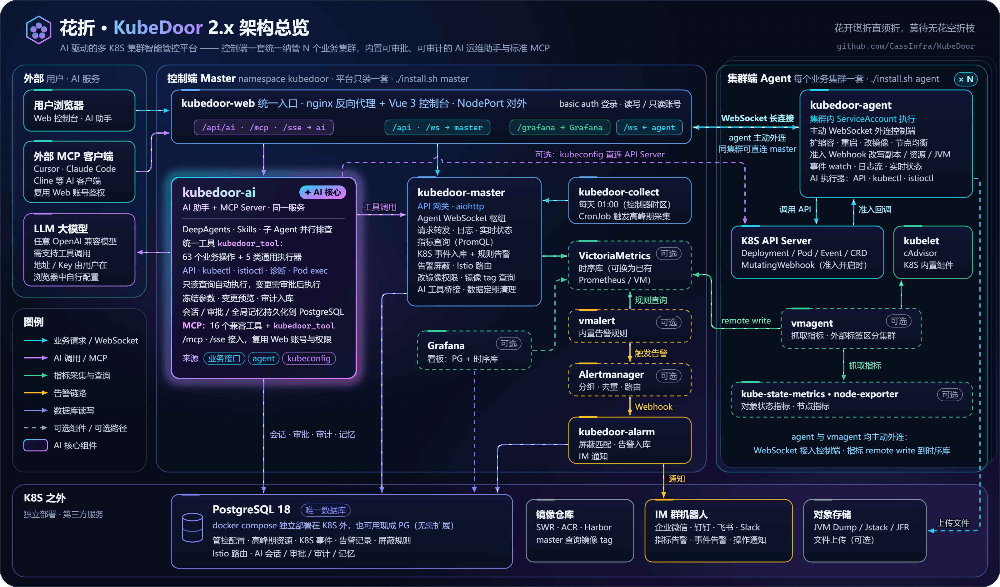
</div>

- **控制端**（`./install.sh master`）：kubedoor-web（nginx统一入口 + Vue 3控制台）、kubedoor-master（API网关、agent连接中心）、kubedoor-ai（AI助手 + MCP Server）、kubedoor-alarm（告警屏蔽、入库与IM通知）、kubedoor-collect（每日高峰期采集CronJob），以及可选的VictoriaMetrics、vmalert、Alertmanager、Grafana。
- **集群端**（`./install.sh agent`）：kubedoor-agent，以及可选的vmagent、kube-state-metrics、node-exporter。agent**主动**通过WebSocket连接控制端，业务集群无需开放入站端口；同集群直连master的Service，跨集群经Web入口并使用读写账号认证。
- **PostgreSQL 18是唯一数据库**：用docker compose独立部署在K8S外，也可用现成的PG（无需扩展），保存管控配置、高峰期资源、K8S事件、告警记录、屏蔽规则、Istio路由以及AI会话、审批与记忆。
- **监控栈可选**：使用内置VictoriaMetrics单机版，或接入已有的Prometheus/VictoriaMetrics；各集群指标用标签`<PROM_K8S_TAG_KEY>=<K8S_NAME>`区分。
- **统一入口**：Web、Grafana、AI助手和MCP共用kubedoor-web的一个NodePort，nginx basic auth登录，账号分读写与只读。
- **AI必装、MCP默认开放**：kubedoor-ai随控制端安装；外部MCP入口（`/mcp`、`/sse`）可用`ENABLE_MCP="false"`关闭，不影响网页里的AI助手。

---

## 💎功能

**覆盖K8S日常运维的完整链路；其中的查询与运维操作，大多也可以直接交给AI助手完成。**

### 1. 🤖AI助手与MCP

**点击顶栏正中的「AI 助手」，在「KubeDoor 助手」里选定集群，用一句话描述问题：查询自动执行，变更先审批再执行，全程可追溯。** 同一套工具、权限与审批也以标准MCP开放给Cursor、Claude Code等外部客户端。

- 🧠**自带模型**：在「模型设置」填写Base URL、API Key和模型名（model ID），「测试连接」会实测工具调用能力；支持任意OpenAI兼容的Chat Completions接口（含无需鉴权的自建模型，模型需支持工具调用），并专门适配DeepSeek思考模式；模型配置只保存在本人浏览器。
- 🎯**资源上下文**：先选「K8S 集群」（每轮只操作选中的集群），可再细化到命名空间、Deployment、Pod；集群旁标注「Agent 在线」「已配置直连」「仅指标 / 历史」。
- 🧰**统一受控工具**：所有集群操作都经同一个工具`kubedoor_tool`，覆盖**63个KubeDoor业务操作**（37个只读、26个写入：日志、事件、资源与JVM、节点、扩缩容、重启、改镜像、定时/周期任务、节点均衡、管控配置等）和**5类通用执行器**（K8S API/CRD、kubectl、istioctl、诊断命令、Pod exec），已有接口优先。
- 🔌**多种连接方式**：KubeDoor已有接口、agent的集群内身份（免kubeconfig），或在「Agent管理」的「AI Kubeconfig」列上传kubeconfig直连（AES-256-GCM加密存储）；agent离线时仍可查询历史与监控数据。
- ⏰**立即/定时/周期运维**：Deployment重启与扩缩容支持立即执行、指定时间执行一次、按Cron周期执行。
- 📈**自由指标查询**：时序库为VictoriaMetrics时，AI可直接编写MetricsQL，服务端强制限定在当前集群，时间范围最长30天。
- 📝**全局记忆**：「总结为记忆」把会话提炼成可编辑草稿，读写账号「保存为全局记忆」后，所有登录用户都可查看和引用；提问时用「引入记忆（N）」按需带入，每轮最多10条。
- 🧩**DeepAgents驱动**：内置「KubeDoor K8S 运维」Skill，子Agent并行排查、上下文自动压缩、PostgreSQL持久化checkpoint；会话保存在服务端（仅本人可见），流式回复、断线续传，关闭对话框后任务继续执行。

#### 🛡安全护栏

| 护栏 | 说明 |
| --- | --- |
| 审批 | 只读查询自动执行；变更、未知CLI命令、curl/openssl、Pod exec会先展示「准确参数」「执行命令」「变更预览」「配置差异」，点「批准这次操作」才执行，30分钟内有效。读写账号可勾选「自动批准执行」（只对当前页面生效） |
| 参数冻结 | 准备阶段把完整参数写入数据库，批准后按原样执行，模型无法替换；kubeconfig被替换后原批准失效 |
| Dry-run | 通用K8S API写操作先以`dryRun=All`生成配置差异，并带resourceVersion/UID前置条件；`kubectl apply`先执行`--dry-run=server`；KubeDoor业务操作展示准确参数与变更预览 |
| 不盲目重放 | 超时或断线的写操作标记为「执行结果不确定」，本轮不再继续写入；服务重启不会重发已派发的操作，待批准的操作可继续审批 |
| 脱敏 | API Key只在单次运行的内存中使用，不写库、不写日志；流式输出、checkpoint、日志与记忆统一脱敏，Secret内容自动隐藏 |
| 只读账号限制 | 只读账号可以对话和查询，但不能批准变更、不能开启自动批准、不能上传kubeconfig、不能维护全局记忆 |
| 审计 | 会话、运行、每次工具调用（含完整参数、预览与结果）和事件写入PostgreSQL；外部MCP调用同样生成会话，可在Web中回看 |

> 提示：只读账号通过AI可执行的只读查询（如K8S API GET、查看日志与ConfigMap）比经典页面更宽，Secret脱敏为尽力而为，请按需分配账号；生产环境请在Web前加HTTPS。

#### 🔗接入外部MCP客户端

- **地址**：`http(s)://<KubeDoor 地址>/mcp`（Streamable HTTP，推荐）；只支持SSE的客户端用`/sse`。`<KubeDoor 地址>`就是Web入口，如`<节点IP>:<Web NodePort>`。
- **鉴权**：复用Web的basic auth账号，请求头`Authorization: Basic <base64(用户名:密码)>`；只读账号只能调用只读工具。
- **工具**：保留1.x的16个工具名（如`get_k8s_list`、`get_pods_logs`、`scale_deployment`、`get_pod_jvm_dump`）+ 统一工具`kubedoor_tool` + Skill资源`skills://kubedoor-k8s`。
- **变更不会直接执行**：写操作和需进入Pod执行的JVM诊断会返回`pending`和`browserlink`（相对路径），用**同一账号**登录Web打开即可审批；执行结果不会回推给MCP客户端，请再次查询核验。
- **关闭外部入口**：`kubedoor.conf`中设置`ENABLE_MCP="false"`。

示例（Cursor的`mcp.json`写法，按接口推导；其它客户端的字段名以其文档为准）：

```json
{
  "mcpServers": {
    "kubedoor": {
      "url": "http://<KubeDoor 地址>/mcp",
      "headers": {
        "Authorization": "Basic <base64(用户名:密码)>"
      }
    }
  }
}
```

`<base64(用户名:密码)>`可用`printf '%s' '用户名:密码' | base64`生成，建议为MCP单独建一个账号。

<details close>
<summary>💬点击展开示例对话（示意：集群、服务名与数据均为虚构）</summary>

```text
上下文：K8S 集群 prod-a · 命名空间 demo · Deployment deploy-demo-order

你：这个服务最近频繁重启，结合日志、事件和监控帮我找原因。

AI 助手：
  工具调用 5（只读查询，自动执行）
    ✓ pods                 Pod 列表与重启次数
    ✓ previous_logs        上次退出的容器日志
    ✓ events               相关 K8S 事件
    ✓ resource_inventory   管控表中的限制值与 JVM 参数
    ✓ metrics              近 6 小时内存曲线
  结论：容器内存持续贴近限制值，上次退出原因为 OOMKilled。
  建议：把内存限制调到 1024MB，并在低峰期滚动重启。需要我提交调整吗？

你：可以，内存限制调到 1024MB，今晚 23:30 重启一次。

AI 助手：
  1 项待批准  resource_config_update
    准确参数：limit_mem_mb=1024（其余字段保持当前值）   [拒绝] [批准这次操作]
  …… 批准后 ……
  1 项待批准  schedule_deployment_restart
    准确参数：run_at=<今天>T23:30                      [拒绝] [批准这次操作]
  …… 批准后 ……
  管控配置已保存（下次发布或重启时生效）；单次重启任务已注册，到点执行。
```

其中`metrics`自由查询需要时序库为VictoriaMetrics。

</details>

📖详见：[AI助手使用说明](docs/ai-assistant.md)

---

### 2. 📡多集群监控

**各集群的vmagent把指标远程写入同一个时序库，靠一个标签区分集群——在一个Web里看全部集群。**

- 🖥「K8S资源总览」大屏：可在「全部集群」与单集群之间切换，展示集群、节点、工作负载、容器组、持久卷数量，4类风险节点徽章和6项最高使用率/分配率，以及今日Top10异常Pod告警、Top10异常K8S事件与最近10日告警趋势，30秒自动刷新。
- 🌊统一时序库：每个集群的指标带`<PROM_K8S_TAG_KEY>=<K8S_NAME>`标签；可用内置VictoriaMetrics单机版，也可接入已有Prometheus/VictoriaMetrics（所有集群需汇总到同一个可查询的库）。
- 🔌已有监控自动适配：集群里已有kube-state-metrics、node-exporter时可关闭自带组件，vmagent会在全集群自动发现已有的kube-state-metrics。
- 📊Grafana看板：「K8S监控看板📊」「节点监控看板📊」「高峰资源看板📊」内嵌在Web中，随安装自动导入（Grafana为可选组件，高峰资源看板的数据来自PostgreSQL）。
- 📈Deployment资源指标：Deployment页按服务展示CPU、内存用量与需求值、限制值（来自时序库）。

<details close>
<summary>🔍点击展开截图 ...</summary>

|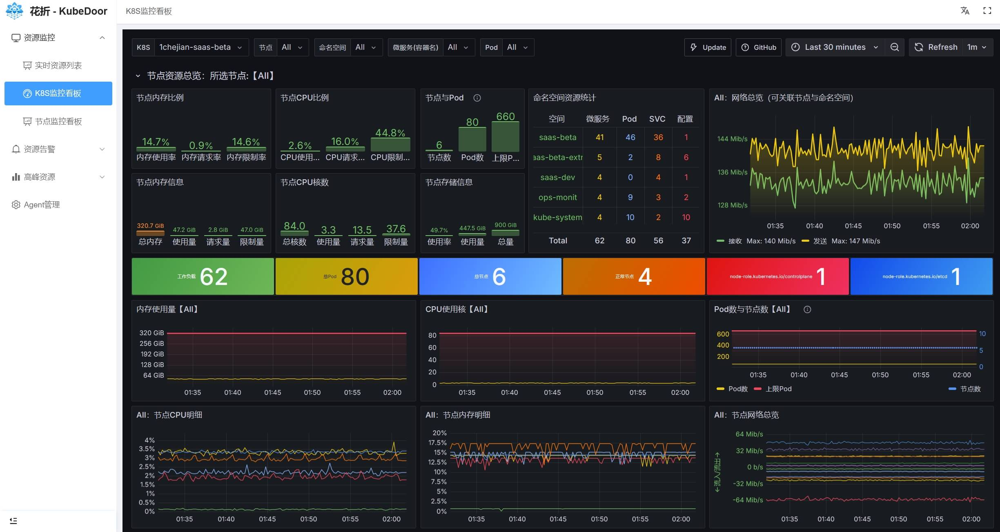|
|-|

</details>

---

### 3. 🎛K8S资源管理

**在一个控制台里管理所有集群的Deployment、Pod、Service、Ingress、ConfigMap、StatefulSet、DaemonSet和节点，常用运维动作一键完成。**

- 🗂统一资源页：各类资源的查看、Monaco编辑器编辑YAML（Create / Apply / Replace）与删除；所选集群和命名空间跨页面记忆。
- ⚡Deployment实时状态【2.1】：WebSocket推送Pod列的就绪/期望副本数与「更新中」「已暂停」「超时」状态，查询栏标注「实时」「连接中」「agent 离线」「实时不可用」，展开明细后Pod增删实时刷新。
- 📜日志查看器：实时跟随、关键字搜索/筛选/逐条定位、ERROR/WARN/INFO多色标记、保留ANSI颜色、「重启前日志」；【2.0】Deployment行的「日志」可聚合全部Pod（最多60个），支持切换容器；选中单个Pod时可「下载日志」（完整日志gzip）。
- 🔁扩缩容与重启：支持「立即执行」「定时执行」「周期执行」，可选「临时扩容」「调度到指定节点」；定时/周期任务由agent以CronJob形式创建在业务集群的`kubedoor`命名空间，Web上的时间按北京时间填写。
- 🧪Pod隔离：「隔离」把Pod的`app`标签改为`<原值>-ALERT`，使其脱离Service流量、保留现场排查，可同时「临时扩容1个Pod」；另支持删除与批量删除。
- 🏷镜像更新：「更新镜像」弹窗自动列出镜像仓库最近20个标签（阿里云ACR、华为云SWR、Harbor，需在`REGISTRY_SECRET_JSON`中配置仓库凭据），也可手动输入；只读账号可按集群、时间段、账号白名单授权，更新进度推送IM。
- 🔍Pod页：【2.0】按节点筛选、命名空间多选；一键跳转该Pod的「事件」「告警」。

<details close>
<summary>🔍点击展开截图 ...</summary>

|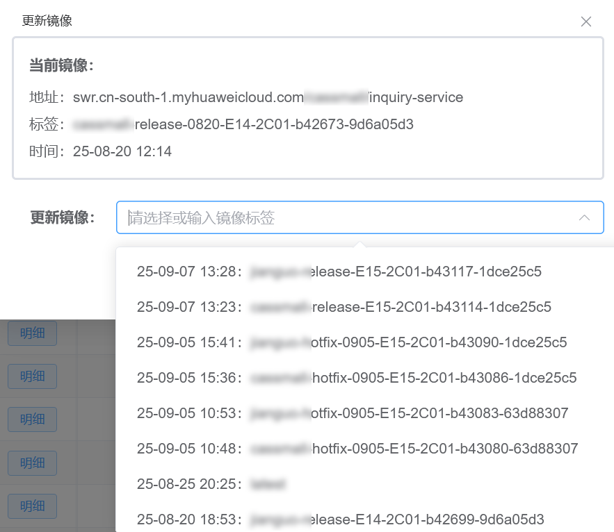|
|-|

</details>

📖详见：[K8S微服务镜像更新配置说明](help/K8S微服务镜像更新配置说明.md)

---

### 4. 🧬告警、事件与屏蔽

**指标告警、K8S事件告警和运维操作通知统一推送到企业微信、钉钉、飞书、Slack；告警屏蔽只拦通知、不丢数据。**

- 🚨指标告警：内置44条vmalert告警规则（Pod状态与资源、Deployment、节点、JVM等）和2条记录规则，经Alertmanager交给kubedoor-alarm推送IM（名称以`K8S_Pod`开头的Pod类告警同时入库PostgreSQL），故障/恢复通知标注持续时长。
- 📋告警分析：「告警面板」按告警名聚合并按日累计；「K8S告警详情」支持多条件筛选、处理标记与自动刷新，可直接对Pod执行隔离、删除、Dump、Jstack、JFR、JVM，或一键「屏蔽」。
- 🔕告警屏蔽【2.0】：Alertmanager风格条件（`=`、`!=`、`=~`、`!~`，正则需完全匹配），快捷时长与「命中预览」，状态分为生效中/待生效/已过期/已解除，支持解除、续期、重新启用、克隆；IM通知里的【屏蔽】链接可直达屏蔽页并预填条件（需配置`KUBEDOOR_EXTURL`）。被屏蔽的告警照常入库、只拦截通知，屏蔽不作用于K8S事件告警。
- 📺K8S事件中心：各集群agent采集全部K8S事件写入PostgreSQL（同一事件只保留一行），在「K8S事件详情」按集群、命名空间、Kind、名称、原因、消息、来源检索，命中规则的事件标为「已告警」。
- 🧾事件规则告警：用JSON配置忽略规则与告警规则（条件不区分大小写），内置关键事件、重启、健康检查失败、挂载失败、调度失败、资源压力、僵尸进程等规则；`ALERT_DEDUP_WINDOW`（默认300秒）内同一事件不重复通知。规则只来自ConfigMap `kubedoor-master-file-cfg`（源文件`deploy/manifests/master/alert_rules.json`），修改后需执行`kubectl -n kubedoor rollout restart deploy/kubedoor-master`。
- 📮运维通知：隔离、删除、JVM诊断、扩缩容、重启、改镜像进度、准入结果都由agent推送IM，可按集群配置不同的机器人；外部系统也可通过`POST /api/custom_alert`写入告警记录。

<details close>
<summary>🔍点击展开截图 ...</summary>

|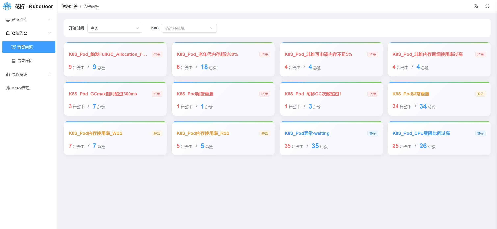|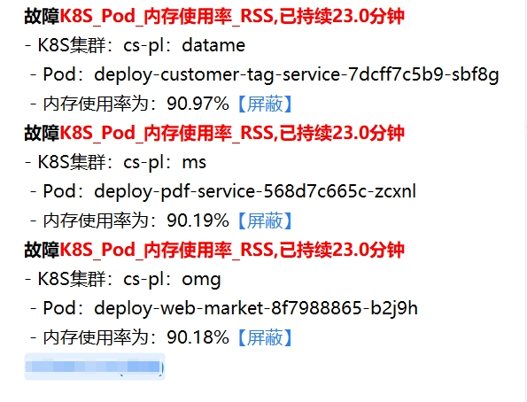|
| ------------------------------------| ----------------------------------- |

</details>

📖详见：[告警屏蔽](docs/alert-silence.md) · [K8S事件告警规则配置说明](help/K8S事件告警规则配置说明.md)

---

### 5. 🚧高峰期资源与准入管控

**采集每个微服务每日业务高峰时段的真实资源用量，再通过K8S准入控制让需求值与高峰期真实用量保持一致——调度更准确，资源碎片更少。**

- 📊高峰期采集：在「Agent管理」开启「自动采集」并设置「高峰时段」（默认`10:00:00-11:30:00`），每天北京时间01:00采集前一天的高峰数据；也可点「采集」补采历史数据（1~90天），重复采集不会重复写入。
- 📐采集口径：CPU、内存取高峰时段**P80**（列名「P80PodCPU%」「P80Pod内存%」），堆内存与G1 Eden使用率取**P95**；管控表采用**最近10天里整个集群CPU总消耗最大的那一天**的数据，CPU/内存用量作为需求值。
- 🗂「高峰资源管控」：集中查看当日Pod、指定Pod、使用率、需求值、限制值与JVM参数，支持批量扩缩容、批量重启、「配置」（保存并扩缩容 / 保存并重启 / 保存）和「新增资源」；「每日高峰资源」查看每天的原始采集数据，「高峰资源看板📊」看长期趋势与TOP10。
- 🚧准入控制：在「Agent管理」开启「准入控制」并选择管控命名空间后，agent自动创建MutatingWebhook。Deployment创建或发布时，副本数（优先「指定Pod」，未指定时取「当日Pod」）、第一个容器的requests/limits及JVM参数改写为管控值；通过scale扩缩容时只改写副本数。
- 🆕新服务管控：管控表中没有的服务，「新服务免确认」关闭时部署会被拒绝并通知，开启时直接放行、不做管控；每日采集也会把新出现的服务自动加入管控表并通知。
- ⏱临时扩容豁免：「临时扩容」后5分钟内，该Deployment的副本变更直接放行。
- ⚡准入加速【2.0】：master用单条SQL查询（5秒超时）并缓存60秒，修改开关、管控表或完成采集后立即生效。

> ⚠️ 准入控制默认关闭，开启后为**fail-closed**：agent或master不可用时，所有未打`kubedoor-ignore`标签的命名空间里的Deployment创建、发布和扩缩容都会被拒绝，应急可执行`kubectl delete mutatingwebhookconfiguration kubedoor-admis-configuration`。
>
> 💡 「新增资源」时「指定Pod」必须填写（0表示发布服务但暂不启动Pod，不能为-1）；-1（按「当日Pod」管控）只适用于已采集过高峰期数据的服务。

<details close>
<summary>🔍点击展开截图 ...</summary>

高峰资源看板（Grafana）：高峰时段全局资源统计与各资源TOP10、命名空间/微服务/Pod级高峰资源分析与资源曲线。

|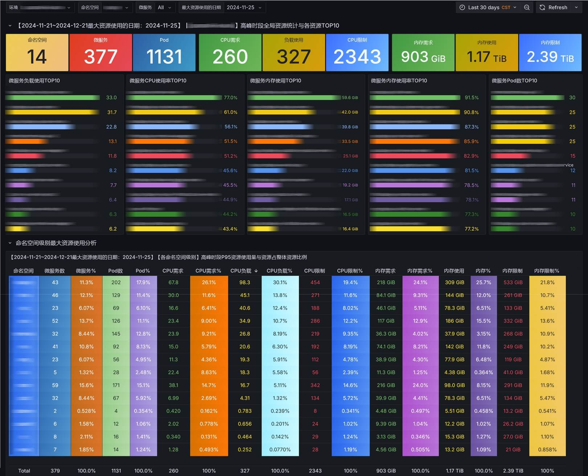|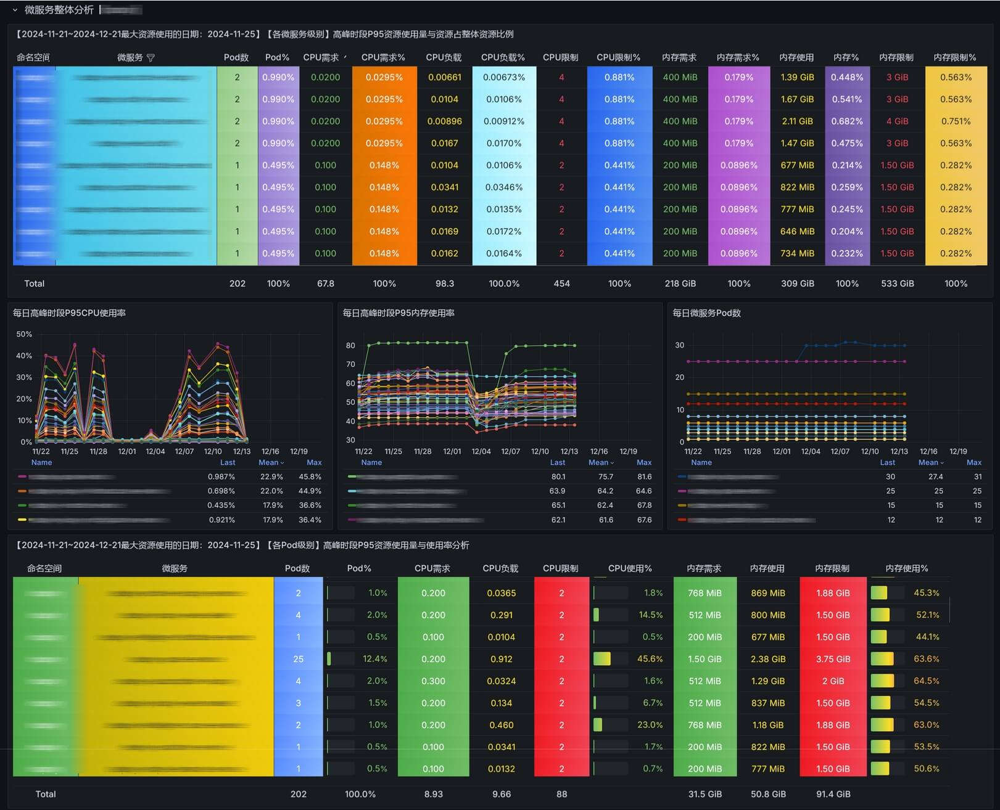|
|-|-|
|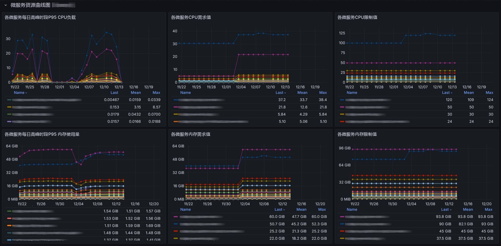|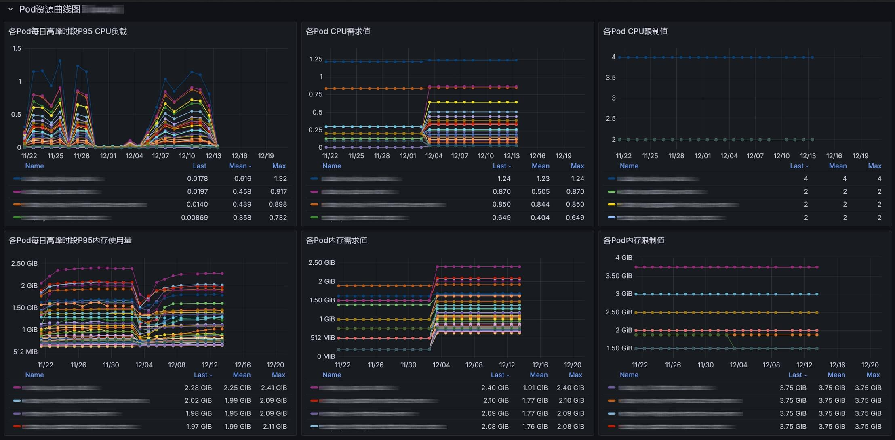|

</details>

📖详见：[K8S资源管控功能说明](help/K8S资源管控功能说明.md)

---

### 6. ☕JVM管控与诊断

**Java微服务的启动参数、高峰期堆内存使用率和一键诊断，都在KubeDoor里完成。**

- 🩺一键诊断：在Deployment、Pod、K8S告警详情页对Pod执行「Dump」「Jstack」「JFR」「JVM」，结果弹窗展示并推送IM；Dump、Jstack、JFR的文件上传到`OSS_URL`指定的对象存储。
- 🧩JVM启动参数管控【2.1】：自动采集Deployment第一个容器`args`（`args[0]`为`java`）中的`-Xms`、`-Xmx`、`-Xss`、`-XX:MaxMetaspaceSize`，在「高峰资源管控」查看并在「配置」中修改（Xss单位k，其余m），下次发布或重启时由准入控制替换为管控值（需开启准入控制）。
- 📈堆内存与G1 Eden【2.1】：每日高峰时段的P95堆内存使用率「P95podHeap%」和G1 Eden使用率「P95podG1E%」，仅展示，辅助调整JVM参数。
- 🚨JVM告警：内置14条JVM告警规则（堆/非堆内存、GC、线程等），vmagent自动抓取带`prometheus.io/jvm: "true"`注解的Pod。

<details close>
<summary>🔍点击展开截图 ...</summary>

|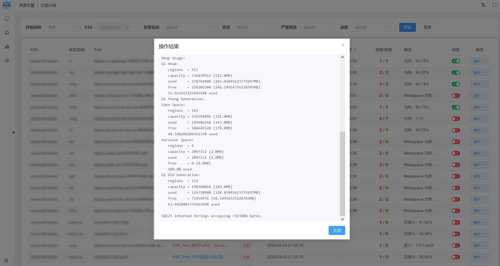|
|-|

</details>

📖详见：[JVM参数管控](docs/jvm-resource-control.md)

---

### 7. ⚖节点均衡与弹性调度

**按节点实时CPU负载生成迁移计划，人工确认后分批迁移；扩容时还能把Pod调度到指定节点或华为云CCI。**

- ⚖「节点均衡」【2.0】：「分析负载」根据节点CPU使用率的极差与标准差迭代生成「迁移计划」，确认后「执行选中」或「执行全部」；采用隔离式迁移，分批执行，新Pod就绪后才进行下一批，旧Pod保留在「隔离Pod」中，确认无误后再清理。
- ⚙「负载均衡配置」：可调整不均衡阈值、均衡目标、最小副本数、黑名单、排除命名空间/节点、源/目标节点选择策略等。仅支持手动执行，依赖metrics-server；执行期间会临时禁止调度（cordon）其它节点，建议在低峰期操作。
- ☁CCI弹性扩容【2.0】：华为云CCE集群在「临时扩容」时勾选「CCI扩容」并设置「本地Pod数」，超出部分弹到CCI。
- 🎯调度到指定节点：扩缩容、重启、隔离时可按「当前CPU」「当前内存」「峰值CPU」「峰值内存」「Pod数」查看节点排行并挑选目标节点。
- 💻「节点管理」：查看节点CPU、内存、磁盘、Pod的用量与可分配量及节点状态，支持批量禁止/允许调度（用量数据依赖metrics-server）。

📖详见：[节点均衡算法与参数](src/kubedoor-agent/load_balance/README.md)（开发者文档；其中的定时检测、自动执行等配置项目前未实现，只能手动执行）

---

### 8. 🌐Istio路由管理（试用）

**把多集群共用的Istio VirtualService作为模板统一维护，一键下发到多个集群；该功能在界面上仍标注为内部试用。**

- 🗺「全局VS管理」：VirtualService与HTTP路由（优先级、匹配/重写规则、route/delegate转发）存放在PostgreSQL，可关联多个集群并按集群「下发」。
- 📥「采集VirtualService」：首次使用时从集群导入已有的VirtualService；导入前会清空该集群已关联的VS（连同这些VS与其它集群的关联），建议只在初始化时使用。
- 🚸「委托VS管理」页面仍在开发中；如需使用Istio路由管理，可联系作者。

<details close>
<summary>🔍点击展开截图 ...</summary>

|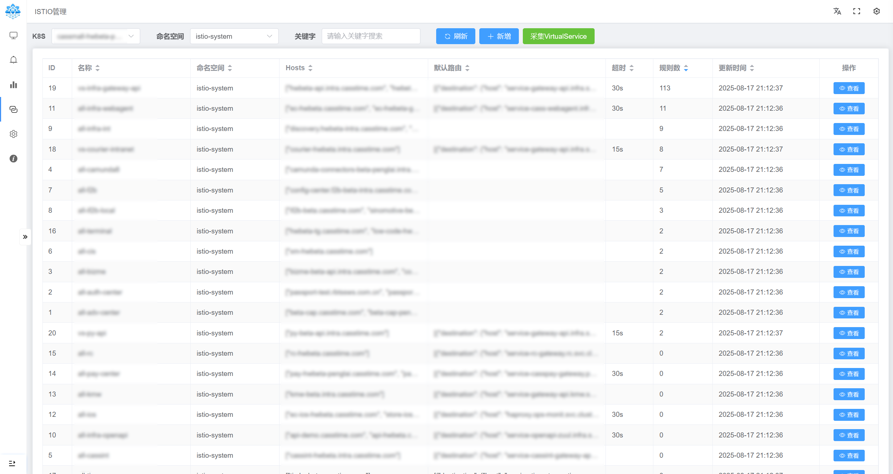|
|-|

</details>

---

### 9. 🔐平台与权限

**一个入口、两种权限：Web、Grafana、AI助手和MCP共用一个NodePort，按账号区分读写与只读。**

- 🚪统一入口：kubedoor-web的nginx负责basic auth登录，并反向代理master、kubedoor-ai与Grafana（`/grafana/`）。
- 👥读写与只读：`WEB_RW_USERS`中的账号为读写，其余为只读；只读账号调用查询白名单以外的接口会返回403（内嵌Grafana为匿名Admin，不受此限制）；镜像更新可通过`UPDATE_IMAGE_JSON`按集群、时间段、账号向只读账号开放。
- 🛰多集群接入：agent首次连接自动登记；「Agent管理」查看在线状态、心跳和版本，「更新」可一键升级agent镜像，并集中配置采集、准入控制与「AI Kubeconfig」。
- 📝操作留痕：nginx以JSON格式记录访问日志（含登录用户与请求体）；运维操作由agent推送IM；AI的会话、审批与工具调用写入PostgreSQL。
- 🧹数据自动清理【2.0】：K8S事件保留90天，告警记录与高峰快照保留365天，master每天分批清理，可在`kubedoor-config`中调整（`0`表示不清理）。
- 🌗界面：简体中文/English（部分页面翻译）、浅色/深色/自动主题，适配移动端。

📖详见：[部署指南](deploy/README.md)

---

## 🚀快速部署

**一份配置文件 + 一个bash脚本，三步完成：起PostgreSQL → 装控制端 → 每个集群装agent，不再需要Helm。** 完整说明见[部署指南](deploy/README.md)。

#### 前置条件

| 项目 | 要求 |
| --- | --- |
| 执行机器 | 能用`kubectl`连上目标集群，bash 4以上 |
| Kubernetes | ≥ 1.21；每日采集与定时/周期任务按北京时间执行（`timeZone: Asia/Shanghai`），需要≥ 1.25，更老的集群按kube-controller-manager的时区执行 |
| metrics-server | 需要：Pod/节点的CPU与内存用量、节点均衡都依赖它 |
| 时序库 | 内置VictoriaMetrics（需要可用的StorageClass，默认100Gi PVC），或已有Prometheus/VictoriaMetrics。Deployment列表、K8S资源总览和高峰期采集都依赖时序库，没有监控数据时页面为空、也采集不到数据 |
| 数据库 | 一台装有Docker Compose的机器运行PostgreSQL 18（K8S节点能访问它的5432端口），或现成的PostgreSQL（建议14+，无需扩展和超级用户） |
| CPU架构 | 官方镜像仅提供amd64 |
| 网络 | 跨集群时，agent要能访问控制端Web的NodePort（WebSocket），vmagent要能访问控制端时序库的NodePort（远程写） |

#### 三步安装

```bash
git clone https://github.com/CassInfra/KubeDoor.git
cd KubeDoor
```

**① 起数据库**（在K8S节点能访问到的机器上，从仓库根目录开始）

```bash
cd deploy/postgres
cp .env.example .env
vi .env                 # 至少改掉 PG_PASSWORD
docker compose up -d
docker compose logs -f postgres    # 看到 database system is ready 就行
```

默认镜像只有amd64，海外或ARM机器可在`.env`里设置`PG_IMAGE=postgres:18-alpine`。不用手动建表，master与kubedoor-ai启动时会自动建好。

**② 装控制端**（在能用kubectl连上集群的机器上，从仓库根目录开始）

```bash
cd deploy
cp kubedoor.conf.example kubedoor.conf   # 从模板复制一份配置
vi kubedoor.conf        # 改 PG_HOST / PG_PASSWORD / MSG_TOKEN 等
./install.sh master
```

- `PG_HOST`填K8S里的Pod能访问到的地址（通常是数据库宿主机的内网IP），不能填`127.0.0.1`。
- 已有Prometheus/VictoriaMetrics时，设置`ENABLE_VICTORIA_METRICS="false"`并填写`PROM_URL`、`PROM_TYPE`。
- 想先检查生成的YAML：`./install.sh render master -o /tmp/out`。

**③ 装集群端**（每个业务集群执行一次；单集群就在同一个集群再执行一次）

```bash
vi kubedoor.conf        # 改 K8S_NAME 和 MASTER_WS（换机器执行时先 cp kubedoor.conf.example kubedoor.conf）
./install.sh agent
```

- `K8S_NAME`：集群的唯一标识，只能用字母、数字、`-`、`_`。
- `MASTER_WS`：同集群填`ws://kubedoor-master.kubedoor`；跨集群填`ws://<读写账号>:<密码>@<控制端节点IP>:<Web NodePort>`，同时把`REMOTE_WRITE_URL`改成控制端时序库的外部写入地址（装控制端时脚本会打印）。
- 多个集群建议各用一份配置：`./install.sh agent -c ./cluster-a.conf`。
- 几十秒后即可在「Agent管理」看到该集群「在线」。

#### 访问Web

- 浏览器打开安装脚本打印的`http://<节点IP>:<NodePort>`，默认账号`kubedoor` / `kubedoor`（读写）。
- ⚠️ 请尽快修改默认口令（最好在第②步安装前就改好）：`WEB_AUTH_USERS`（htpasswd格式）预置了两个读写账号，其中一个供跨集群agent连接使用，两个都要改。安装后再改时：
  - 控制端：重新执行`./install.sh master`，再执行`kubectl -n kubedoor rollout restart deploy/kubedoor-web`使新账号生效；
  - 跨集群agent：同步修改`MASTER_WS`中的账号密码，重新执行`./install.sh agent`，再执行`kubectl -n kubedoor rollout restart deploy/kubedoor-agent`。

#### 首次使用

1. 打开「Agent管理」，确认集群状态为「在线」。
2. 打开「自动采集」，在弹窗中设置「高峰时段」（默认`10:00:00-11:30:00`）。
3. 点「采集历史数据」列的「采集」，选择「采集天数」（默认10天，可选1~90），把历史高峰数据写入管控表；之后每天北京时间01:00自动采集。新装的监控要经历一个完整的高峰时段后才有数据可采，之后也可执行`kubectl -n kubedoor create job --from=cronjob/kubedoor-collect collect-now`立即采集一次。
4. 在「高峰资源管控」确认数据无误后，再按需开启「准入控制」（默认关闭）。
5. 点顶栏「AI 助手」→「模型设置」，填写Base URL、API Key、模型名并「测试连接」，即可开始对话。

#### 生产环境提示

- 🔒Web与MCP默认是HTTP + basic auth，生产环境建议在Web前加HTTPS（Ingress/LB需支持WebSocket）。
- 🚧准入控制为fail-closed，agent或master不可用时Deployment变更会被拒绝；应急执行`kubectl delete mutatingwebhookconfiguration kubedoor-admis-configuration`。卸载或重装agent前，先在「Agent管理」关闭「准入控制」。
- 💾请把PostgreSQL数据、`kubedoor.conf`和`kubedoor.conf.ai-secrets`（与Secret `kubedoor-ai-security`一致）一起备份；更换AI加密密钥会使已保存的kubeconfig无法解密。
- 📌`NAMESPACE`请保持默认的`kubedoor`，准入控制、定时任务等功能依赖这个命名空间。

---

## ♻升级说明

**2.x改用PostgreSQL和脚本化部署，从1.x升级需要全新安装；2.x版本之间修改`TAG_*`后重新执行安装脚本即可。**

#### 从1.x（Helm）升级

- 1.x的ClickHouse/MySQL数据不会迁移，2.x按全新安装设计；旧Helm chart注入的是`CK_*`变量，不要与新清单混用。
- 建议顺序：
  1. 如果开启过准入控制，先在旧版Web的「Agent管理」里关闭「准入控制」；
  2. 用`helm uninstall`卸载旧的控制端与agent（如`helm uninstall kubedoor -n kubedoor`、`helm uninstall kubedoor-agent -n kubedoor`，release名以实际安装为准）；
  3. 按[快速部署](#快速部署)全新安装；已有的Prometheus/VictoriaMetrics可继续使用（`ENABLE_VICTORIA_METRICS="false"` + `PROM_URL`、`PROM_TYPE`）。
- 1.x的MCP地址（独立`kubedoor-mcp`的NodePort `/sse`）已废弃，改用Web入口的`/mcp`。

#### 从2.0.x升级到2.1

1. 更新到最新仓库代码；在`kubedoor.conf`中把`TAG_MASTER`、`TAG_AGENT`、`TAG_WEB`改为`2.1.0`，并新增`TAG_AI="2.1.0"`（不写会回退到`latest`）；旧的`TAG_MCP`不再使用，可以删除。
2. `ENABLE_MCP`的含义变了：现在只控制Web是否开放kubedoor-ai的`/mcp`、`/sse`、`/messages`，默认`true`。
3. 执行`./install.sh master`，再到各集群执行`./install.sh agent`（新版agent才支持AI的通用工具）。
4. 安装脚本只做`apply`，不会删除2.0.x遗留的独立MCP服务，请手动删除：
   ```bash
   kubectl -n kubedoor delete deploy/kubedoor-mcp svc/kubedoor-mcp
   ```
5. 外部MCP客户端改用`/mcp`（`/sse`仍然兼容）；2.1起外部MCP的写操作需在Web中批准后才执行。
6. 首次安装2.1时脚本会生成`kubedoor.conf.ai-secrets`，请与PostgreSQL数据一起备份。

> 2.x内部升级：master与kubedoor-ai采用Recreate策略，升级期间AI/MCP短暂不可用，开启了准入控制的集群在master重启期间Deployment变更会被拒绝，建议低峰期操作。nginx配置以subPath挂载，若Web镜像标签未变，需执行`kubectl -n kubedoor rollout restart deploy/kubedoor-web`让新配置生效。

---

## 📚文档

**先看部署指南，再按需查阅各功能说明。**

| 文档 | 内容 |
| --- | --- |
| [部署指南](deploy/README.md) | 一个脚本 + 一份配置安装控制端与各集群agent，PostgreSQL独立部署，含常见场景、改配置与排查 |
| [AI助手](docs/ai-assistant.md) | 模型配置、资源范围、多轮对话、变更审批、全局记忆、kubeconfig直连与外部MCP |
| [告警屏蔽](docs/alert-silence.md) | 屏蔽规则语法、状态、命中预览与IM【屏蔽】链接 |
| [JVM参数管控](docs/jvm-resource-control.md) | Xms/Xmx/Xss/MaxMetaspaceSize的采集与管控，高峰期堆内存与G1 Eden使用率 |
| [K8S资源管控功能说明](help/K8S资源管控功能说明.md) | 基于准入控制管控副本数、需求值与限制值 |
| [K8S事件告警规则配置说明](help/K8S事件告警规则配置说明.md) | 事件告警规则文件的语法、默认规则与生效方式 |
| [K8S微服务镜像更新配置说明](help/K8S微服务镜像更新配置说明.md) | 按集群、时间段、账号授权镜像更新，以及镜像仓库凭据配置 |
| [常见问题](help/FAQ.md) | 常见问题与排查 |

**开发者参考**
- [src/kubedoor-ai/README.md](src/kubedoor-ai/README.md)：AI服务的接口、环境变量、构建与测试
- [src/kubedoor-tools/README.md](src/kubedoor-tools/README.md)：AI与agent共用的K8S执行库及安全边界
- [src/kubedoor-web/README.md](src/kubedoor-web/README.md)：前端开发与构建
- [src/kubedoor-agent/load_balance/README.md](src/kubedoor-agent/load_balance/README.md)：节点均衡算法与参数

---

## 🔔KubeDoor交流群与🧧赞赏

<div align="center">

#### 如果觉得项目不错，麻烦动动小手点个⭐️Star⭐️ 如果你还有其他想法或者需求，欢迎在 issue 中交流


**加作者微信或关注公众号加入交流群**

</div>

## 🙇贡献者
<div align="center">
<table>
<tr>
    <td align="center">
        <a href="https://github.com/starsliao">
            
            <br />
            <sub><b>StarsL.cn</b></sub>
        </a>
    </td>
    <td align="center">
        <a href="https://github.com/xiaofennie">
            
            <br />
            <sub><b>xiaofennie</b></sub>
        </a>
    </td>
    <td align="center">
        <a href="https://github.com/shidousanxia">
            
            <br />
            <sub><b>shidousanxia</b></sub>
        </a>
    </td>
    <td align="center">
        <a href="https://github.com/comqx">
            
            <br />
            <sub><b>comqx</b></sub>
        </a>
    </td>
    <td align="center">
        <a href="https://github.com/seaworld008">
            
            <br />
            <sub><b>seaworld008</b></sub>
        </a>
    </td>
  </tr>
</table>
</div>

## 🥰鸣谢

感谢如下优秀的项目，没有这些项目，不可能会有**KubeDoor**：
- [Python](https://www.python.org/) [AIOHTTP](https://github.com/aio-libs/aiohttp) [FastAPI](https://fastapi.tiangolo.com/) [Flask](https://flask.palletsprojects.com/) [VUE](https://cn.vuejs.org/) [Pure Admin](https://pure-admin.cn/) [Element Plus](https://element-plus.org) [ECharts](https://echarts.apache.org/) [Monaco Editor](https://microsoft.github.io/monaco-editor/) [Kubernetes](https://kubernetes.io/) [VictoriaMetrics](https://victoriametrics.com/) [Prometheus](https://prometheus.io/) [PostgreSQL](https://www.postgresql.org/) [Grafana](https://grafana.com/) [Nginx](https://nginx.org/) [LangChain](https://github.com/langchain-ai/langchain) [LangGraph](https://github.com/langchain-ai/langgraph) [DeepAgents](https://github.com/langchain-ai/deepagents) [FastMCP](https://gofastmcp.com/) ...

**特别鸣谢**
- [**CassTime**](https://www.casstime.com)：**KubeDoor**的诞生离不开🦄**开思**的支持。
