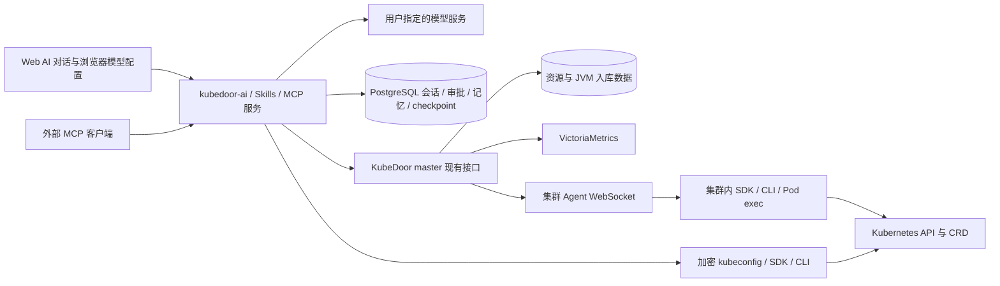

# AI 助手

KubeDoor AI 助手将自然语言问题与已有管理接口、Kubernetes API、命令工具和监控
数据连接起来，用于集群日常管理、日志排查、资源检查和配置变更。后端服务为
`kubedoor-ai`，Web 对话和外部 MCP 共用工具网关、权限、审批与审计。

## 功能总览

| 功能 | 当前实现 |
| --- | --- |
| 页面入口 | 顶部居中的“AI 助手”按钮，彩色渐变、机器人图标、悬浮与光效动画；对话框适配桌面和手机 |
| 自定义模型 | 配置 Base URL、API key、模型名并测试实际工具调用；配置按登录用户名保存在当前浏览器 |
| 多轮与会话管理 | 流式回复、新建、切换、重命名、删除会话；服务器持久化已发送历史，支持中断与审批恢复 |
| 会话名称 | 首条消息被服务端接受后，独立异步生成简短主题；不阻塞对话，失败则保留“新会话”，用户手动重命名优先 |
| 会话响应优化 | 新会话先显示本地草稿；访问过的会话先显示缓存历史，再核验最新执行状态；取消过时读取 |
| 资源上下文 | K8S 单选，命名空间、Deployment、Pod 可选具体资源或“全部”；逐级加载，只向模型传入实际选择 |
| 集群连接 | 在线 Agent 及已有 KubeDoor 接口，或上传 kubeconfig 后直连；AI 按需求选择适用工具 |
| Kubernetes 通用能力 | SDK API、已发现的资源类型及 CRD、受控 kubectl/istioctl、Pod 内诊断命令和辅助诊断工具 |
| 复用平台能力 | 已有日志、事件、资源/JVM、节点、工作负载、重启、扩缩容、定时和周期任务等接口优先 |
| 监控与历史数据 | 查询 Prometheus/VictoriaMetrics 指标及 PostgreSQL 入库资源、JVM、事件、告警数据 |
| 工具与回复展示 | 工具区默认折叠，逐项显示运行状态，手动展开查看参数、差异和结果；回复支持 Markdown、表格和代码块 |
| 执行批准 | 默认人工批准变更、未知 CLI 和 Pod 命令；读写账号可勾选自动批准执行 |
| 全局记忆 | 总结本人会话为可编辑草稿，或手动新增；共享查看、搜索、分页、多选，所选记忆仅随下一轮发送 |
| Skills 与 Agent | DeepAgents 加载 KubeDoor 运维 Skill，支持子 Agent、上下文压缩及持久 checkpoint |
| 外部 MCP | 提供 Streamable HTTP 和兼容 SSE 入口，保留原工具并提供统一工具与 Skill 资源 |

## 快速使用

1. 登录 KubeDoor，点击页面顶部的“AI 助手”按钮，打开“模型设置”，填写并测试模型配置。
2. 选择一个 K8S 集群。按需继续选择命名空间、Deployment、Pod；只选集群也可提问。
3. 输入需求并发送，例如“检查这个服务是否有异常，结合日志、事件和监控说明原因”。
4. 工具执行时可展开工具栏查看过程。需要变更时审阅参数和差异，批准或拒绝；也可提前勾选自动批准。
5. 继续追问以复用当前会话上下文；需要独立任务时新建会话。发送按钮旁可总结经验或选择下一轮引入的记忆。

首条消息发送成功后，系统会用独立的标题请求根据用户原文生成简短主题。该请求
与工具调用、流式回复和审批完全分开，模型响应慢或失败都不会影响当前对话；手动
修改过的名称不会被自动生成结果覆盖。

在线且支持通用工具的 Agent 可直接用于集群操作；需要 AI 服务直连时，在“Agent管理”
页上传、测试并保存该集群的 kubeconfig。实时连接暂不可用时，仍可按数据源
状态查询已入库历史和监控数据。

## 模型配置与连接测试

模型地址、API key 和模型名由用户在
设置中填写，按登录用户名保存在当前浏览器。使用支持工具调用的
OpenAI-compatible Chat Completions 接口；自建模型服务也可使用。

Base URL 填供应商 API 基址，例如 `https://api.example.com/v1`，请求会自动追加
`/chat/completions`。供应商提供 `/api/openai/v1` 等路径前缀时应保留；只有 API
位于域名根路径时才只填域名。完整的 `/chat/completions` 接口地址也会自动识别为
对应基址。模型名填写供应商 API 使用的准确 `model` ID，需支持工具调用且当前
API key 有权使用；页面展示名或自定义别称可能无法调用。若测试出现
`OpenAIModelNotFoundError`，先核对基址和模型 ID，再检查账号或 key 的模型权限。

| 供应商提供的地址 | Base URL 填写示例 |
| --- | --- |
| `https://api.example.com/v1/chat/completions` | `https://api.example.com/v1` |
| `https://api.example.com/api/openai/v1/chat/completions` | `https://api.example.com/api/openai/v1` |
| `https://api.deepseek.com/chat/completions` | `https://api.deepseek.com`，也兼容官方 `/v1` 基址 |

这里配置的是模型供应商地址，与 KubeDoor 页面地址或 Kubernetes API 地址无关。
无需认证的自建模型可不填 API key；仍需支持工具调用。页面也支持清除本机模型配置。

连接测试还会验证实际工具调用；只能回复文字的模型会显示失败提示。测试接口的
HTTP 422 通常是本服务封装的失败状态，不能单凭该状态判断模型名或 API key 有误。
具体原因看 `error.code` 和 `error.details` 中的 `upstream_status`、`upstream_code`、
`upstream_param`、`upstream_message`；URL 参数在发起请求前校验失败时返回 HTTP 400。
使用响应中的 `error.details.diagnostic_id` 在 AI 服务日志中定位同一失败记录：

```bash
kubectl -n kubedoor logs deployment/kubedoor-ai --since=15m
```

查找“模型连接测试失败”记录及对应诊断 ID，
即可看到失败阶段、异常类型、上游状态、主机、API 路径和模型 ID。
日志不记录 API key、URL 查询参数、请求 body 或供应商完整响应。

## DeepSeek 配置与兼容性

使用 DeepSeek 官方 API 时，Base URL 填 `https://api.deepseek.com`（也兼容
`https://api.deepseek.com/v1`），模型 ID 可填 `deepseek-flash`，API key 使用官方
账号生成的 key。第三方网关的地址、模型 ID 与 key 应按网关文档或模型列表填写；
网关可能提供不同的模型 ID 映射。保存后使用“测试连接”验证实际工具调用能力。

DeepSeek 当前默认启用思考模式，无需增加思考开关。本服务使用
`langchain-deepseek==1.1.1` 的 ChatDeepSeek 处理普通与 SSE 响应，并补齐后续请求
中的 `reasoning_content` 回传；历史消息通过 PostgreSQL checkpoint 恢复。
工具选择采用模型默认行为，避免强制 `required` 或指定工具导致默认思考模式请求失败。
当前继续使用 Chat Completions，暂不接入 Responses API。

2026-10-05 使用修正后的代码，经 OpenAI 兼容的模型网关（Base URL 形如
`https://api.example.com/v1`）调用 `deepseek-flash` 实测：连接与工具调用探测、
工具结果回传、下一轮对话均通过。测试工具仅返回本地连接验证结果，没有访问
Kubernetes；该记录不代表其他网关或模型的兼容性。

以下按官方文档核对当前接入方式：

| 官方文档 | 当前处理 |
| --- | --- |
| [Chat Completions API](https://api-docs.deepseek.com/zh-cn/api/create-chat-completion) | 使用兼容 Chat Completions 的调用方式，保留供应商要求的 API 基址和准确模型 ID |
| [思考模式](https://api-docs.deepseek.com/zh-cn/guides/thinking_mode) | 保留响应中的 `reasoning_content`，工具回传与后续请求携带相应上下文 |
| [多轮对话](https://api-docs.deepseek.com/zh-cn/guides/multi_round_chat) | 使用持久会话与 checkpoint 回传历史消息，支持多轮工具调用 |
| [工具调用](https://api-docs.deepseek.com/zh-cn/guides/tool_calls) | 验证实际工具调用，不强制 `required` 或指定工具；通用工具参数保留自由字典结构，未启用 strict schema |
| [JSON 输出](https://api-docs.deepseek.com/zh-cn/guides/json_mode) | 运维对话允许自然语言回复，未强制 JSON 输出模式 |
| [视觉能力](https://api-docs.deepseek.com/zh-cn/guides/vision) | 官方模型能力按该文档提供；当前页面仅支持文本输入，未增加图片上传 |
| [Responses API](https://api-docs.deepseek.com/zh-cn/guides/responses_api) | 当前按需求暂不接入，继续使用 Chat Completions |

## 部署与升级

AI 助手是必装组件，安装控制端时总会部署 `kubedoor-ai` 服务，不能关闭。
`deploy/kubedoor.conf` 的 `ENABLE_MCP`（默认 `true`）只控制是否对外开放 MCP 接口。
Deployment、Service、镜像组件均使用 `kubedoor-ai`，部署清单为
`deploy/manifests/master/30-ai.yaml`，镜像版本由 `TAG_AI` 配置。
master、web、AI 需使用匹配的版本；使用 Agent 的通用 SDK/CLI 执行能力还需
支持该能力的集群 Agent。
新版 Agent 在连接时声明通用 AI 工具能力；旧版 Agent 的通用工具请求会立即
提示升级，已有 KubeDoor 数据接口不受影响。

安装或升级使用最新仓库中的脚本和模板，在 `deploy/kubedoor.conf` 中按需设置
`ENABLE_MCP`，并填写已发布的 `TAG_MASTER`、`TAG_WEB`、`TAG_AI`；需要新增 Agent
通用能力时，同时在相应集群配置中更新 `TAG_AGENT`。控制端重新安装会应用现有资源，
无需先卸载：

```bash
cd deploy
# 可先生成清单检查；-c 可指定自己的配置文件。
./install.sh render master -o /tmp/kubedoor-render
./install.sh master
```

从没有 AI 助手的版本（如 2.0.x）升级、修改 `ENABLE_MCP` 或 nginx 路由时，必须重新
应用部署模板。仅更新镜像不会更新 `nginx-config` 中的反向代理规则。nginx 配置通过
`subPath` 挂载，应用新配置后还需重启 Web；即使镜像标签未变化，也应执行：

```bash
kubectl -n kubedoor rollout restart deployment/kubedoor-web
kubectl -n kubedoor rollout status deployment/kubedoor-web
kubectl -n kubedoor rollout status deployment/kubedoor-ai
```

KubeDoor 需部署在 `kubedoor` 命名空间。环境变量修改后还需重启使用它的服务。
若启用新的 Agent 通用工具，在各业务集群用对应配置执行 `./install.sh agent`。

AI 服务复用现有 PostgreSQL，启动时创建自己的会话、运行、事件和连接表，
全局记忆表及消息引用字段也在启动时幂等创建，并初始化 LangGraph checkpoint。
模型 API key 只在一次运行期间存在内存中，
不作为模型配置持久化到服务端。

安装脚本首次生成内部访问令牌和 kubeconfig 加密密钥，保存在配置文件旁的
`*.ai-secrets` 文件（0600）及 `kubedoor-ai-security` Secret。必须备份并在
升级、迁移时保留这些密钥；更换加密密钥会使已有 kubeconfig 无法解密。
安装时检查已有 Secret；本地密钥与集群不一致会停止安装，避免覆盖加密密钥。
不要把密钥文件或渲染后的 Secret 提交到 Git。

Agent 和 AI 的 Dockerfile 将 `src/kubedoor-tools` 复制到构建环境，并通过
`pip install` 安装共享执行库，CLI 也安装在两个镜像内。tools 是共享库，
无需额外 Deployment、Service 或镜像。两者使用仓库根目录作为构建上下文：

```bash
docker build -f src/kubedoor-agent/Dockerfile -t kubedoor-agent:local .
docker build -f src/kubedoor-ai/Dockerfile -t kubedoor-ai:local .
```

AI 镜像使用 Python 3.13 slim，以已验证的依赖兼容性为准；master、agent 的
既有运行镜像保持不变。CLI 的 `KUBECTL_VERSION`、`ISTIO_VERSION`、`YQ_VERSION`
可通过 build args 调整，以匹配目标集群的支持版本。前端构建使用国内镜像仓库中的
Node 24 LTS（Debian bookworm slim）和固定的 pnpm 10.34.6，依赖从 npmmirror 安装。
依赖安装与前端编译分开执行；旧构建机上的镜像兼容性仍需实际构建验证。

AI、Agent 的 Python 依赖默认使用清华 pip 源，AI 的 apt 使用阿里云 Debian 源，
Agent 的 apk 使用华为云源。kubectl 从 GitHub 社区镜像下载，istioctl、yq 从
GitHub Releases 直接下载；默认 kubectl 版本带固定 SHA256 校验。安装源和
版本覆盖方式详见 [共享工具库说明](../src/kubedoor-tools/README.md)。

请将 `kubedoor-ai-security` Secret、`*.ai-secrets` 与 PostgreSQL 数据一起备份。
AI 服务保持单副本，使用 `Recreate` 更新策略，
避免更新时多个运行时同时恢复同一数据库的会话；更新期间 AI/MCP 会短暂不可用。

## 集群与 kubeconfig

在“Agent管理”页表格的“AI Kubeconfig”列点击“上传”（已配置的显示为“管理”），
上传 YAML/JSON，选择 context、测试连接后保存。
上传的是该集群共享连接；只有读写账号可上传、替换、测试和删除，原始配置
不会提供下载。替换失败保留旧配置。该列显示“AI 未启用”表示页面暂时连不上
AI 服务（AI 助手本身无法关闭），可用 `kubectl -n kubedoor get pod -l app=kubedoor-ai`
检查服务状态。

上传文件最大 1 MiB。同一集群的连接供有权限的登录用户共用，内容加密保存到
PostgreSQL；页面只展示 context、服务器地址及测试状态。测试会查询集群版本、
身份和 API 发现，并检查命名空间、Pod、日志、Deployment 修改及 Pod exec 等
权限；部分权限可用时，只能执行该凭据实际允许的操作。

配置需包含内嵌 CA、token，或内嵌客户端证书和私钥。依赖本机文件、
`exec`/`auth-provider` 认证插件的配置需要先转换为自包含配置。连接测试从
AI 服务所在网络执行，网络可达不代表拥有全部操作权限，测试结果分别显示。
Agent 离线但 kubeconfig 可用时仍可操作。
已登记的离线集群仍可查询 PostgreSQL 历史资源/JVM 数据和监控指标，实时
查询能力由具体连接状态决定。

对话中的 K8S 选择是本轮操作边界；命名空间、Deployment、Pod 是上下文参考。
模型可访问同一集群的关联资源。会话允许后续轮次切换集群，历史保留每轮集群标记。
运行中或待批准时会锁定本轮集群，需先停止当前轮次或等待其结束，再切换集群或
会话。拒绝某次工具调用后，模型仍可能继续完成当前轮次。

资源选择按 K8S → 命名空间 → Deployment → Pod 逐级加载：选择集群后加载命名空间，
选定具体命名空间后加载 Deployment，选定具体 Deployment 后加载 Pod。
各级独立显示加载状态；切换上级会清空下级选择并取消旧请求。
选择“全部”或未选择具体父级时，不预取下级的全集群资源列表。
模型上下文只携带实际已选资源，不注入菜单候选列表或未选字段；AI 仍可按问题
使用工具查询该集群的资源，“全部”保留原有查询语义。

例如只选择 `prod-k8s` 时，模型只收到该集群标识；选择 `demo` 后才附加该
命名空间，继续选择 Deployment、Pod 时再附加相应对象。命名空间、Deployment、
Pod 选择帮助明确目标，不构成同一集群内关联资源的访问白名单。

## 对话与工具显示

桌面对话框已加宽、加高，并按屏幕尺寸适配；手机继续使用全屏布局。
点击“新建会话”先打开本地“未发送”草稿，首次发送时保存到服务器。
未发送的草稿只保留在当前页面，刷新页面会清除。

已发送会话按登录用户隔离，支持重命名、删除和继续多轮对话。消息输入支持
Enter 发送、Shift + Enter 换行。对话历史保留每轮集群标记，工具结果保留来源、
查询时间、截断情况和执行状态。

切换有页面缓存的会话时先显示历史，同时同步最新运行和审批状态。
同步期间可继续输入或切换会话，核验完成后才可发送和审批；快速切换会取消旧会话
读取，避免其结果覆盖新会话。页面刷新或切换登录账号后清除历史缓存。

工具区位于 AI 回复之前，默认折叠。收起栏逐项显示工具调用及状态，执行中的工具
显示转圈提示；点击工具区可手动展开或收起，查看具体参数、结果和差异。
展开与收起完全由用户控制，回复开始或结束都不自动收起。待批准数量仍显示在
收起栏，可点击展开审核，再批准或拒绝操作。

资源栏的 Skills 选择框前提供“自动批准执行”选项，默认不勾选，只读账号不可开启。
勾选后，当前页面收到的待批准操作会逐次自动批准；取消勾选后恢复人工确认，
已提交的操作不会撤回。此选项只保留在当前页面内存，刷新页面或切换账号后恢复
未勾选。自动批准失败时会关闭选项，并保留待批准操作供手动处理。

关闭对话框后当前任务继续执行，自动批准选项也保持当前状态；它不会绕过账号
写权限、集群边界或后端命令审查。流连接中断时页面恢复进度，不重新提交已接受
的操作；“停止”会请求取消后续执行，已被 Kubernetes 接受的修改仍需核验。

助手回复支持 Markdown 表格、列表和代码块。宽表格可横向滚动，代码块保留
换行与缩进，方便查看资源清单和诊断命令。

Markdown 原始 HTML 禁用，链接按安全规则处理，图片只显示替代文字；当前对话
输入仅支持文本，不提供图片上传。

## 全局记忆

全局记忆库保存可复用的运维背景和结论，所有已登录用户可查看、选择引用；读写
账号可手动新建、编辑和删除。原会话及其历史仍只对所属用户开放，保存记忆才会
把该条标题和正文共享到记忆库。列表分页显示标题等信息，正文按需读取。

发送按钮旁提供两个入口：

- **总结为记忆**：对当前本人会话的已完成内容生成标题与 Markdown 草稿；编辑、预览后由读写账号保存到全局库，只读账号可生成和查看草稿。
- **引入记忆**：打开全局记忆管理界面，按标题搜索、分页浏览、点击查看正文，跨页选择需要的记忆并引入下一轮；读写账号还可手动新增、编辑和删除。

所有用户可为本人会话生成记忆草稿，使用独立的模型摘要请求，不调用 Kubernetes 工具。
摘要仅使用已完成轮次；当前仍执行或等待批准时需先结束，长会话会注明截取的输入范围。
生成结果只是可编辑的标题、正文草稿，检查并保存后才进入全局记忆库；也可直接
手动编写。记忆提供背景，资源操作仍按本轮所选集群、权限和审批流程执行。

发送前选择的记忆仅在当前轮与用户问题一起附加给模型，保存该次引用的标题、
正文和版本快照到会话历史及 checkpoint。本轮请求被服务端接受后清除选择，提交失败保留
选择以便重试。下一轮不会重新读取记忆库或再次追加，已有引用通过正常多轮历史
继续提供上下文；新会话需要重新选择引用。编辑或删除全局记忆不会改写已发送的
历史快照，待批准任务恢复也继续使用原上下文。

每轮最多引用 10 条记忆，所选正文合计最多 32000 字符。全局记忆的编辑、删除
使用版本检查；发生冲突时刷新最新内容再修改。

单条标题最多 200 字符，正文最多 20000 字符，支持 Markdown 预览。历史消息中
的“本轮引入记忆”默认折叠，展开显示发送时的标题、正文与版本；切换或新建会话
会清空尚未发送的选择，保存记忆不会自动选中。

例如第一轮选择“Exporter 内存排查经验”后发送问题，正文作为这条用户消息的
附件进入历史；第二轮直接追问即可，通过历史继续参考已有经验，无需再次选择。
之后其他人修改了记忆库中的原条目，已发送消息和待批准任务仍保留原来的内容。
这里复用用户消息和 checkpoint，没有额外的运行级记忆快照机制。

记忆默认不自动加载，模型也不自动改写全局库。经验积累通过“生成草稿 → 人工
编辑保存 → 按需引入”完成，不改变模型本身的参数；记录适用条件和核验结果，
由本轮工具结果判断是否仍适用。

## 工具与 Skills

DeepAgents 加载仓库内 `kubedoor-k8s` Skill，每轮还会把实际工具目录注入模型上下文，
外部调用方可通过 `GET /api/ai/tools` 查询。已有且适用、可用的 KubeDoor API 优先，
包括查询和重启、扩缩容、定时、周期执行等业务操作；接口没有覆盖需求、目标资源
不适用或来源不可用时，再使用直连 SDK/CLI 或 Agent 通用执行器。实时核验也先用
适合的现有读取接口。Agent 使用自己的集群内身份，无需上传 kubeconfig。

### 数据来源与选择规则

| 来源 | 使用方式 |
| --- | --- |
| `kubedoor` | 调用现有 master、Agent、数据库和监控业务接口；满足需求且可用时优先使用 |
| `agent` | 通过在线且声明通用工具能力的 Agent，在目标集群内执行 SDK、CLI、Pod 命令，无需 kubeconfig |
| `direct` | AI 服务使用已保存的 kubeconfig 与选定 context，直连目标 Kubernetes API |
| `auto` | 已有目录操作走 KubeDoor；通用操作存在 kubeconfig 时选 direct，否则选 agent |

AI 先根据用户问题选择操作，再选择来源。同一集群同时具备 Agent 与 kubeconfig
时，可用的业务接口仍优先；`auto` 不会把通用 `api` 或 `kubectl` 自动改写成业务
操作，因此 Skill 明确要求先匹配已有接口。写入失败后先查询实际状态，再决定下一步。

### 已接入的常见能力

| 类别 | 能力举例 |
| --- | --- |
| 日志与事件 | 当前及上次退出容器日志、实时事件、入库事件与告警；结合监控定位异常 |
| 资源与 JVM | CPU/内存 requests、limits、高峰历史快照及 JVM 配置；已有 JVM 内存、dump、jstack、JFR 流程 |
| 工作负载 | Deployment/StatefulSet/DaemonSet 查询、Pod 明细、重启、扩缩容、Deployment 镜像更新 |
| 调度与节点 | 节点资源排名、禁止或恢复新调度、Pod 删除/隔离、既有负载均衡流程 |
| 服务与配置 | Service 后端、Ingress 规则、ConfigMap 和资源 YAML 读取、应用、删除 |
| 监控 | 工作负载指标、节点排名、VictoriaMetrics 自由 MetricsQL 查询及已有 Prometheus 指标接口 |
| 通用排障 | 动态 K8S API/CRD、kubectl、istioctl、Pod exec，辅助 jq/yq/curl/dig/openssl/rg |

能力是否可执行取决于所选集群、可用连接、账号与 Kubernetes 凭据权限，以及
命令审查结果。工具目录与通用 API/CLI 配合覆盖需求，执行过程和结果由工具栏展示。

### Deployment 立即、定时和周期操作

Deployment 的重启、扩缩容按执行方式提供下列工具：

| 执行方式 | 重启工具 | 扩缩容工具 | 时间参数 |
| --- | --- | --- | --- |
| 立即执行 | `restart_deployment` | `scale_deployment` | 无 |
| 指定日期时间执行一次 | `schedule_deployment_restart` | `schedule_deployment_scale` | `run_at`，无时区的 `YYYY-MM-DDTHH:mm` 或空格分隔格式 |
| 按周期执行 | `cron_deployment_restart` | `cron_deployment_scale` | `cron`，五段 Cron 或支持的 K8S 标准宏 |

这些接口**只针对 Deployment**，不接受 Pod、StatefulSet 或 DaemonSet 名称。
命名空间和 Deployment 可采用明确的页面选择；用户在问题中明确指定的目标优先。
扩缩容还需要非负整数 `replicas`。定时、周期工具复用现有 `/api/cron` 接口，
由已有 Agent 创建任务，AI 无需另行生成实现重启的 YAML 或申请额外 RBAC。

例如“帮我每天凌晨 2 点重启 demo 的 order-service”应调用
`cron_deployment_restart`，参数为 `namespace=demo`、
`deployment=order-service`、`cron=0 2 * * *`；指定日期只执行一次则使用
`schedule_deployment_restart`，避免误建每日任务。创建后优先通过 `resource_content`
核验 `kubedoor` 命名空间内的 CronJob；同名任务先读取，不能默认覆盖。
注册成功与 Deployment 实际重启完成分别确认。

Agent 创建的定时、周期 CronJob 设置了 `spec.timeZone: Asia/Shanghai`，`run_at`
和 `cron` 都按北京时间执行，与 Web 上的定时执行一致；该字段需要 K8S 1.25 及以上，
更老的集群（或未带此设置的旧版 Agent）按 kube-controller-manager 的时区执行。
`run_at` 不接受时区偏移，用户给出其他时区的时间时需先换算成北京时间。单次任务
沿用现有月、日、时、分调度和执行后删除逻辑，原接口不强制年份；网关按北京时间只接受
该月日时分下一次到达的年份，已过去或更远的年份都会被拒绝；沿用现有月日调度语义，
不提供新增的跨年绝对时间保证。

### 资源管控与监控语义

目录还覆盖节点调度、批量 Pod 操作、Service 后端与 Ingress 规则、资源 YAML
读取和编辑、StatefulSet/DaemonSet 立即重启、镜像标签、CCI 调度配置、负载均衡、
入库历史事件与告警查询等既有页面能力。完整分类和工具名见
[Skill 工具参考](../src/kubedoor-ai/skills/kubedoor-k8s/references/tools.md)，
具体参数以当前 `/api/ai/tools` 返回为准；CRD 和接口不支持的类型使用通用 K8S 工具。

`resource_inventory` 复用 `/api/db/res/list`，包含 CPU/内存 requests、limits 和
Xms、Xmx、Xss、MaxMetaspaceSize。它表示管控或已采集数据，不能当成实时进程值；
null 表示未采集。工具卡显示来源、查询时间、数据类型及截断情况。

`resource_config_update` 复用资源管控编辑接口，保存 Deployment 的数据库配置，
在下次发布或滚动重启时应用，不自动重启。仅调整 JVM 时先读取现有配置，保留
必填的 `limit_mem_mb`、`limit_cpu_m`、`pod_count_manual` 当前值；JVM 字段省略
表示保留，显式 `null` 表示清除。`resource_pod_count` 仅保存数据库人工管控副本数，
立即扩缩容应使用 `scale_deployment`，不能把数据库保存成功当成在线资源已生效。

查询自动执行。修改、未知 CLI 和 Pod 命令先展示目标、参数或差异，默认人工批准后
执行；勾选“自动批准执行”后由页面提交批准，仍经过现有后端审批、权限和集群边界检查。
批准后不会自动换通道重试写操作；超时、断线或停止时已提交的修改可能完成，
需要查询实际状态。停止执行不等于回滚。辅助 CLI 采用参数数组运行，不开放后端通用 shell。

VictoriaMetrics 的自由 MetricsQL 查询经 master 网关使用现有 `PROM_URL`，
保留单机版或集群版 tenant 路径，并强制注入当前 K8S 标签。普通 Prometheus
继续使用已有指标接口；自由查询不能依赖 VM 专用的标签隔离扩展。

当前不提供 Istio 共享数据库模板专用流程；实际集群的 Istio CRD 和 istioctl
仍可通过通用工具使用。

### 提问示例

| 问题 | 应使用的能力 |
| --- | --- |
| “列出这个微服务的 request、limit 和 JVM 配置” | 优先读取已入库资源接口，说明数据采集时间；需要当前状态时再核验实时资源 |
| “检查这个 Pod 为什么重启，结合异常日志和事件分析” | 日志、上次退出日志、Pod 状态、事件和监控，必要时执行经批准的 Pod 内诊断 |
| “每天凌晨 2 点重启 demo 的 order-service” | Deployment 周期重启接口；核实任务是否已有，K8S 1.25 以下的集群还需核实控制器时区 |
| “在指定日期时间把这个 Deployment 扩到 3 个副本” | Deployment 定时扩缩容接口；提交后回读任务，执行时间语义见前文 |
| “检查 Istio 代理状态与当前 VirtualService 配置” | 受控 istioctl 或 Kubernetes CRD API；不修改平台共享数据库模板 |

## 权限与执行边界

| 操作 | 只读账号（`read`） | 读写账号（`rw`） |
| --- | --- | --- |
| 本人会话、模型配置与模型连接测试 | 可使用 | 可使用 |
| 已允许的只读 K8S、指标、历史查询 | 可使用 | 可使用 |
| 变更资源、未知 CLI、Pod exec 及需要批准的诊断 | 不可执行 | 通过默认人工批准或所选自动批准流程执行 |
| 共享记忆查看、引用、本人会话摘要草稿 | 可使用 | 可使用 |
| 全局记忆新建、修改、删除与草稿发布 | 不可使用 | 可使用 |
| kubeconfig 上传、替换、测试、删除 | 不可使用 | 可使用 |

具体只读分类由工具网关判断，不能仅凭工具名称或命令含有 `get` 推断。资源选择
固定本轮 K8S；命令不能覆盖集群连接，不开放后端通用 shell。需要批准的参数在
执行前保存，批准恢复使用原参数，不能由模型临时替换。支持的写操作提供 dry-run
及差异预览，超时、停止或未知结果均先核验实际状态。

## 外部 MCP

`ENABLE_MCP` 默认开启，使用现有 Web 的认证账号访问 `/mcp`（Streamable HTTP）
或兼容的 `/sse`、`/messages`。旧工具名和参数保留。工具共用 Web 助手的权限、
批准及审计流程；需要人工确认的调用返回待批准动作和浏览器入口。

原 16 个工具名称和参数保留，统一工具为 `kubedoor_tool`，运维 Skill 资源为
`skills://kubedoor-k8s`。Web 助手始终启用，外部 MCP 的暴露由 `ENABLE_MCP` 控制。

## 架构与选型依据



调研后采用 [DeepAgents](https://github.com/langchain-ai/deepagents) 0.7.21，
复用 Skills 加载、子 Agent、对话压缩和 LangGraph 中断/checkpoint。执行工具
接入 KubeDoor 网关，默认文件后端仅提供会话内文件和只读 Skill，集群操作
通过受控工具调用。Python 版本按实际依赖验证选择，后续可独立升级此服务。

| 组件 | 职责 |
| --- | --- |
| `kubedoor-web` | 顶部入口、模型配置、资源级联、多轮会话、工具审批与共享记忆界面 |
| [kubedoor-ai](../src/kubedoor-ai/README.md) | 模型/DeepAgents、Skills、MCP、统一工具网关、会话/checkpoint、加密直连配置及全局记忆 |
| [kubedoor-tools](../src/kubedoor-tools/README.md) | SDK、CLI、Pod exec、诊断与准备预览的共享 Python 库，安装于 AI 和 Agent 镜像内 |
| `kubedoor-master` | 复用业务接口、历史数据库与指标查询，转发集群 Agent 请求 |
| `kubedoor-agent` | 集群内既有业务操作，以及使用 ServiceAccount 的通用执行器 |

全局记忆采用显式用户消息附件和持久 checkpoint；没有启用 DeepAgents 默认
自动加载或编辑全局记忆文件的流程，以实现默认关闭、按需选择和单轮追加。

| 方案或资料 | 本次考虑 |
| --- | --- |
| [DeepAgents](https://github.com/langchain-ai/deepagents) | 可作为库嵌入现有服务，复用已有 Web 认证和 PostgreSQL；本次采用 |
| [DeepSeek Harness](https://github.com/deepseek-ai/deepseek-harness) | 提供插件化 Harness；官方声明处于 developer preview，兼容性仍快速变化 |
| [QwenPaw](https://github.com/agentscope-ai/QwenPaw) | 完整个人 Agent 工作站，支持 Skills/MCP；接入本项目需适配其工作站、身份和持久化模型 |
| [HolmesGPT](https://github.com/HolmesGPT/holmesgpt) | Kubernetes 与可观测数据排障参考，支持多种数据源和 MCP |
| [kstack](https://github.com/kubetail-org/kstack) | Kubernetes investigate/logs/metrics/exec 的 Skill 参考，部分能力依赖 Kubetail/tmux |
| [terminal-skills](https://github.com/chaterm/terminal-skills) | 包含 Kubernetes 命令、部署和排障 Skill，可参考流程；本次编写适配 KubeDoor 网关的 Skill |
| [VictoriaMetrics 查询 API](https://docs.victoriametrics.com/victoriametrics/#prometheus-querying-api-enhancements) | 使用服务端 `extra_label` 强制限定集群，保持已有 tenant 路径 |

这些第三方项目作为调研参考；运行时已集成 DeepAgents 和仓库自有
`skills/kubedoor-k8s`，没有自动安装第三方 Skill/插件。

## 验证与本地测试

前端在 `src/kubedoor-web` 运行 `pnpm typecheck`、`pnpm build`、`pnpm test:ai`、
`pnpm test:ai-markdown`。Windows 本地构建可使用 PowerShell：

```powershell
$env:NODE_OPTIONS = '--max-old-space-size=8192'
pnpm exec vite build
```

后端在仓库根目录运行：

```bash
python -m pytest -q src/kubedoor-tools/tests
python -m pytest -q src/kubedoor-ai/tests
python -m pytest -q src/kubedoor-master/tests
python -m pytest -q src/kubedoor-agent/tests/test_ai_tools.py src/kubedoor-agent/tests/test_ws_lifecycle.py
python -m pytest -q deploy/tests/test_ai_render.py
```

安装测试依赖（pytest、pytest-asyncio、aiohttp）和 AI 服务依赖后运行上述
Python 检查。AI 服务的 PostgreSQL 集成测试默认跳过，需要显式配置本地隔离库：

```bash
AI_TEST_PG_DATABASE=kubedoor_ai_test \
AI_TEST_PG_USER=postgres AI_TEST_PG_PORT=5432 AI_TEST_PG_PASSWORD=test \
python -m pytest -q src/kubedoor-ai/tests/test_postgres_integration.py
```

集成测试仅允许 localhost 和 `kubedoor_ai_test` 前缀数据库，使用模拟模型、
master 与本地 Kubernetes HTTP 服务，验证持久会话、流式恢复、精确批准、
取消/重启不重放、加密 kubeconfig，以及 MCP HTTP/SSE。未在实际集群执行
修改，Docker 镜像构建和真实模型效果需在部署环境验证。

已验证内容包括工具参数与审批恢复、会话切换竞态、级联资源请求、Markdown
与表格、全局记忆权限和版本冲突、单轮引用、库内修改/删除后的历史与审批恢复。
记忆功能还进行了本地 PostgreSQL 新库/旧表幂等迁移验证，以及桌面、手机、深色
模式下的真实浏览器操作检查。大部分自动化测试使用模拟模型与本地 API。
