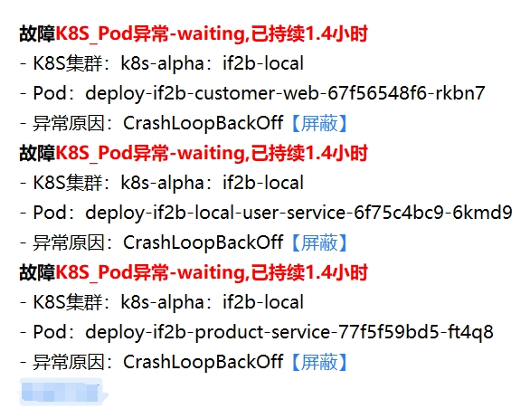
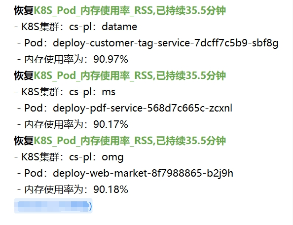

# 告警屏蔽（Alert Silence）

参照 Alertmanager Silence 设计的告警屏蔽功能。告警推送到 kubedoor-alarm 后先做屏蔽判断，
命中规则的告警**不再推送通知**，但**仍然入库并打上屏蔽标记**，保证事后可追溯。

**作用范围**：屏蔽只对经过 kubedoor-alarm 的告警生效，即 Alertmanager 推送过来的指标告警；
外部系统经 `/api/custom_alert` 写入的自定义告警也会做同样的判断并打标记。
**K8S 事件告警不受屏蔽规则影响**：它由 kubedoor-master 按
[K8S 事件告警规则](../help/K8S事件告警规则配置说明.md) 直接发 IM，不经过 kubedoor-alarm
（agent 发出的运维操作通知同理）。想少收某类事件告警，请调整事件告警规则里的忽略规则。

---

## 1. 整体链路

```
Alertmanager
   │
   ├─ POST /alert/store ───────► 入库路径
   │                              silence.match_alert(count_hit=False)
   │                              └─► 命中：仍写入 k8s_pod_alert_days，
   │                                        silenced=true, silence_id=<规则ID>
   │
   └─ POST /msg/<im>=<token> ──► 通知路径
                                  silence.match_alert(count_hit=True)
                                  ├─► 命中：跳过该条，累加规则 match_count
                                  └─► 全部命中：返回 204，一条通知都不发

Web ──► kubedoor-master /api/db/silence/* ──► alert_silences 表
                                                    ▲
kubedoor-alarm 每 SILENCE_CACHE_TTL 秒拉取一次 ──────┘
```

设计取舍：

- **规则 CRUD 走 master，屏蔽判断走 alarm。** Web 已经统一经 master 访问数据库（认证、
  Nginx 代理都是现成的）；alarm 用自己的 psycopg 连接池直接读表，不依赖 master 是否存活。
- **入库而不丢弃。** 屏蔽期间发生了什么在「K8S告警详情」页可以完整回看，「告警面板」的告警数也不会
  出现无法解释的缺口。代价是 `k8s_pod_alert_days` 多两个字段。
- **fail-safe 偏向发通知。** 匹配引擎的任何异常（正则非法、规则格式损坏等）都按
  「不屏蔽」处理并记日志；刷新规则时查库失败则沿用上一次缓存的规则（从未加载成功时即不屏蔽）。
  宁可多发一条通知，也不能因为屏蔽功能故障漏掉真实故障。

---

## 2. 匹配语义

### matcher 结构

```json
{ "key": "namespace", "op": "=", "value": "payment" }
```

| op   | 含义       | 说明                                          |
| ---- | ---------- | --------------------------------------------- |
| `=`  | 等于       | 字符串精确相等                                |
| `!=` | 不等于     |                                               |
| `=~` | 正则匹配   | **全匹配**，等价于两端加 `^...$`              |
| `!~` | 正则不匹配 | 全匹配取反                                    |

- **规则内多个 matcher 是 AND**，全部满足才算命中。
- **多条规则之间是 OR**，任意一条命中就屏蔽。
- **告警上不存在的标签，其值视为空字符串 `""`。** 因此 `foo!=bar` 会命中没有 `foo` 标签的
  告警——这与 Alertmanager 行为一致。
- `=~` 是全匹配：`pod =~ order` **不会**命中 `order-abc12-x9k2`，要写 `order-.*`。

### 可用的标签名

告警的**原始 Prometheus 标签全部可用**，另外叠加了一层规范化别名，屏蔽命名不统一的场景：

| 规范 key      | 取值来源（按顺序取第一个非空）              |
| ------------- | ------------------------------------------- |
| `env`         | `labels[PROM_K8S_TAG_KEY]`                  |
| `namespace`   | `namespace` → `k8s_ns`                      |
| `pod`         | `pod` → `k8s_pod`                           |
| `container`   | `container` → `k8s_app`                     |
| `alertname`   | `alertname`                                 |
| `alertgroup`  | `alertgroup`                                |
| `severity`    | `severity`                                  |
| `description` | `annotations.description`（取最后一段）     |

写法同义词：`alert_name`→`alertname`、`alert_group`→`alertgroup`、`k8s`/`cluster`→`env`。

### 示例

```jsonc
// 大促期间屏蔽 payment 命名空间下所有 order 服务的 CPU 告警
[
  { "key": "env",       "op": "=",  "value": "prod-a" },
  { "key": "namespace", "op": "=",  "value": "payment" },
  { "key": "pod",       "op": "=~", "value": "order-.*" },
  { "key": "alertname", "op": "=",  "value": "K8S_Pod_CPU使用率" }
]

// 屏蔽除 Critical 外的所有测试集群告警
[
  { "key": "env",      "op": "=~", "value": "test-.*" },
  { "key": "severity", "op": "!=", "value": "Critical" }
]
```

---

## 3. 规则状态

状态**不落库**，由时间字段实时推导，因此不需要定时任务去翻状态：

| 状态      | 判定条件                                     | UI 表现                       |
| --------- | -------------------------------------------- | ----------------------------- |
| `active`  | 已开始、未结束、未解除                       | 绿色实心标签 + 剩余时间进度条 |
| `pending` | `now() < starts_at`                          | 蓝色标签 + “X 后生效”         |
| `expired` | `ends_at IS NOT NULL AND now() >= ends_at`   | 灰色标签，**整行淡化**        |
| `revoked` | `revoked_at IS NOT NULL`（手动解除）         | 橙色标签，**整行淡化**        |

`ends_at` 为 `NULL` 表示**长期有效**，不会自动过期，只能手动解除。

进度条颜色随时间推进变化（<70% 绿 → <90% 橙 → ≥90% 红），临近失效时一眼可见。

### 解除 vs 删除

- **解除**（`revoked`）：规则立即失效，记录保留，命中统计保留，可随时「重新启用」。
- **删除**：记录彻底消失，历史命中统计一并丢失。UI 上删除确认框会引导优先用解除。

---

## 4. 数据表

### `alert_silences`

| 字段            | 类型          | 说明                                     |
| --------------- | ------------- | ---------------------------------------- |
| `id`            | `serial`      | 主键                                     |
| `matchers`      | `jsonb`       | matcher 数组，非空（CHECK 约束保证）     |
| `starts_at`     | `timestamptz` | 生效时间，默认 `now()`                   |
| `ends_at`       | `timestamptz` | 结束时间；`NULL` = 长期有效              |
| `comment`       | `text`        | 屏蔽原因备注                             |
| `created_by`    | `text`        | 创建人                                   |
| `revoked_at`    | `timestamptz` | 手动解除时间；`NULL` = 未解除            |
| `revoked_by`    | `text`        | 解除人                                   |
| `match_count`   | `bigint`      | 累计拦截的告警通知条数                   |
| `last_match_at` | `timestamptz` | 最近一次命中时间                         |

约束：`ends_at IS NULL OR ends_at > starts_at`；`matchers` 必须是非空 JSON 数组。

### `k8s_pod_alert_days` 新增字段

| 字段         | 类型      | 说明                                              |
| ------------ | --------- | ------------------------------------------------- |
| `silenced`   | `boolean` | 最近一次告警是否被屏蔽（覆盖写，反映当前状态）    |
| `silence_id` | `integer` | 命中的规则 ID；未命中为 `NULL`                    |

覆盖写而非累积：解除屏蔽后新来的告警会把当天记录改回未屏蔽，页面上看到的始终是当前状态。

---

## 5. API

规则管理接口挂在 kubedoor-master 上，全部参数化查询。

| 方法   | 路径                            | 说明                                       |
| ------ | ------------------------------- | ------------------------------------------ |
| `GET`  | `/api/db/silence/list`          | 列表，响应内附带各状态计数 `stats`         |
| `GET`  | `/api/db/silence/label_values`  | 某标签近 30 天出现过的候选值               |
| `POST` | `/api/db/silence/preview`       | 命中预览：用条件回溯最近 N 天历史告警      |
| `POST` | `/api/db/silence/add`           | 新建                                       |
| `POST` | `/api/db/silence/edit`          | 编辑                                       |
| `POST` | `/api/db/silence/revoke`        | 解除                                       |
| `POST` | `/api/db/silence/extend`        | 续期（同时清掉解除标记，让规则重新生效）   |
| `POST` | `/api/db/silence/delete`        | 删除                                       |

时间字段统一以 **ISO 8601（带时区）**收发，前端用 dayjs 按浏览器本地时区渲染，避免前后端
时区不一致导致生效时间偏移。

`list` 的 `keyword` 会同时模糊搜备注、创建人、matchers 原文；若 keyword 是纯数字，额外按
规则 ID 精确匹配（用于从「K8S告警详情」页的「已屏蔽」标记直接定位规则）。

### 命中预览的局限

预览把 matcher 翻译成 SQL 去查 `k8s_pod_alert_days`，因此**只有落库的字段能预览**
（`env` / `namespace` / `pod` / `container` / `alertname` / `alertgroup` / `severity` /
`description`）。自定义 Prometheus 标签在告警表里还原不出来，会被跳过并在
`unsupported_keys` 中返回，此时**预览结果偏大**（实际生效时条件更严），UI 会给出提示。

正则预览用 PostgreSQL 的 `~` 并补上 `^(?:...)$` 锚点以对齐全匹配语义。PG 的正则（ARE）与 Python 不完全兼容，
Python 特有的写法（如 `(?i)`）在预览时会报错，但不影响规则本身保存和生效。

---

## 6. 页面入口

- **监控告警 → 告警屏蔽**：规则管理主页面。顶部按状态分组（生效中/待生效/已过期/已解除/
  全部）并带计数；表格里点「已屏蔽」次数可跳到「K8S告警详情」页查看被拦下的告警。
- **K8S告警详情 → 操作 → 屏蔽**：自动带出该行的 `env`/`namespace`/`alertname`/`pod` 作为
  匹配条件，改一改就能提交。
- **K8S告警详情的「已屏蔽」标记**：命中屏蔽的告警行会显示静音标签，点击跳到对应规则。
- **IM 通知里的【屏蔽】链接**：只有故障通知带，恢复通知不带。在 `deploy/kubedoor.conf` 里配置
  `KUBEDOOR_EXTURL`（KubeDoor Web 的外部访问地址，如 `http://<节点IP>:<NodePort>`）后，链接指向
  KubeDoor 屏蔽页并预填条件（`alertname`/`env`/`namespace`/`pod`）；未配置则退回原来的 Alertmanager
  链接（`ALERTMANAGER_EXTURL`）。

IM 通知示例：左边是故障通知，每条后面带【屏蔽】链接；右边是恢复通知，不带链接。

|||
| --- | --- |

新建/编辑弹窗内置**实时命中预览**，提交前就能看到这条规则会盖住多少历史告警、具体是哪些，
避免写出范围过大的规则把真实故障一起屏蔽掉。

---

## 7. 性能与可靠性

- **规则缓存**：alarm 侧内存缓存有效规则，TTL 由 `SILENCE_CACHE_TTL` 控制（默认 15 秒）。
  告警风暴时不会把库打爆。新建/解除规则最长 15 秒生效。
- **时间窗实时判断**：缓存的是「未解除且未过期」的规则集合，`starts_at`/`ends_at` 在每次
  匹配时按当前时间实时比较，所以缓存 TTL 只影响规则增删的生效延迟，不影响时间窗精度。
- **命中计数批量回写**：命中次数先在内存累加，随缓存刷新批量 UPDATE，避免每条告警一次写库。
  回写失败会把增量放回，下次重试。多副本 alarm 各自累加，SQL 用 `match_count + delta`，
  不会互相覆盖。
- **正则编译缓存**：编译过的正则常驻内存；编译失败的模式记 warn 并按不匹配处理。
- **双重检查锁**：并发请求下只有一个线程真正查库刷新缓存。
