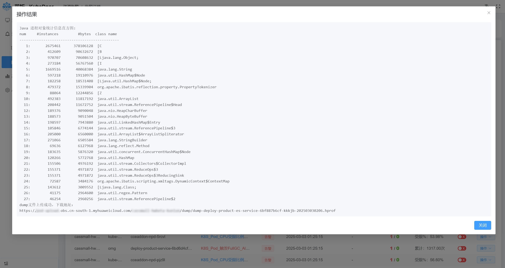
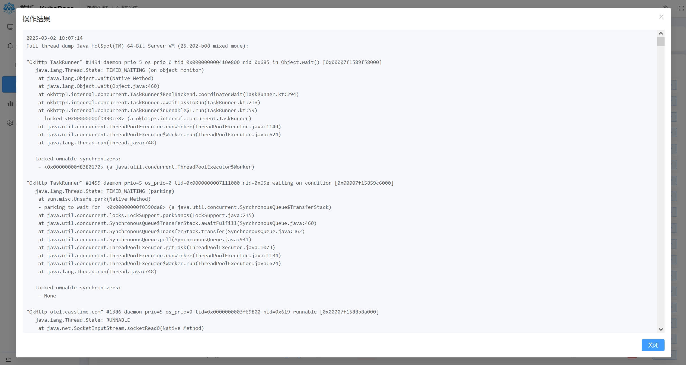

# KubeDoor 常见问题（FAQ）

> 适用于 KubeDoor 2.x（`deploy/install.sh` + `deploy/kubedoor.conf` 部署）。安装步骤见[部署文档](../deploy/README.md)。

排查问题时，先看组件状态和日志（命名空间固定为 `kubedoor`）：

```bash
kubectl -n kubedoor get pods -o wide                         # 也可以执行 ./install.sh status
kubectl -n kubedoor logs deploy/kubedoor-master --tail=100   # 控制端
kubectl -n kubedoor logs deploy/kubedoor-agent --tail=100    # 集群端，在对应的业务集群执行
```

文中尖括号里的内容（如 `<K8S_NAME>`、`<PG_HOST>`、`<控制端节点IP>`、`<Web NodePort>`）请换成自己的值；`origin_prometheus` 是 `PROM_K8S_TAG_KEY` 的出厂值，改过的请换成自己的。

---

## 对象存储（Java 诊断文件上传）

### Q：Java 服务的 Dump、Jstack、JFR 文件上传到哪里？对象存储要怎么配置？

对 Java Pod 执行「Dump」「Jstack」「JFR」时，KubeDoor 会在**业务 Pod 的容器里**用 `curl -T` 把生成的文件直接上传到对象存储，地址为 `<OSS_URL>/<K8S_NAME>/<dump|jstack|jfr>/<文件名>`，上传成功后把这个地址作为下载链接推送到 IM。

Dump、Jstack 的执行结果会显示在页面弹窗里，末尾就是文件的下载地址：

<details>
<summary>🔍点击展开截图 ...</summary>

Dump：对象统计直方图，末尾是 dump 文件的下载地址



Jstack：先显示线程栈，下载地址在最末尾（截图未滚动到底）



</details>

目前上传**不带账号密码**，对象存储需要允许 Pod 所在的内网免认证直接上传。以华为云 OBS 为例：

1. 创建一个桶，`kubedoor.conf` 里的 `OSS_URL` 填桶的访问域名，如 `https://<桶名>.obs.<区域>.myhuaweicloud.com`（装完后再改的话，修改 `kubedoor-agent-config` 这个 ConfigMap 并重启 `deploy/kubedoor-agent`）。
2. 给桶加一条内网读写、外网只读的桶策略：点击「编辑桶策略」，选择「JSON视图」，输入以下内容（把 `<桶名>` 换成你的桶名）：

```json
{
    "Statement": [
        {
            "Sid": "内网读写外网只读",
            "Effect": "Allow",
            "Principal": {
                "ID": [
                    "*"
                ]
            },
            "Action": [
                "ListBucket",
                "ListBucketVersions",
                "HeadBucket",
                "GetBucketLocation",
                "PutObject",
                "GetObject",
                "ModifyObjectMetaData",
                "ListBucketMultipartUploads",
                "ListMultipartUploadParts",
                "AbortMultipartUpload",
                "RestoreObject",
                "GetObjectVersion",
                "PutObjectAcl",
                "GetObjectVersionAcl",
                "GetObjectAcl"
            ],
            "Resource": [
                "<桶名>",
                "<桶名>/*"
            ],
            "Condition": {
                "IpAddress": {
                    "SourceIp": [
                        "10.0.0.0/8",
                        "100.0.0.0/8"
                    ]
                }
            }
        }
    ]
}
```

- `SourceIp` 是允许免认证读写的内网网段，示例为 `10.0.0.0/8` 和 `100.0.0.0/8`，请按集群节点 / Pod 访问 OBS 时的实际出口网段调整。
- 这条策略只对 `SourceIp` 里的网段生效。下载链接如果要在这些网段之外（如办公网、公网）打开，还需要给桶额外开放外网只读（匿名读取对象），不要开放外网写入。
- 业务容器里需要有 `curl`：没有时只会在 Alpine 镜像里自动执行 `apk add curl`，其它镜像需要自带 `curl`，否则这几个操作会直接失败。
- `OSS_URL` 为空时，这几个功能无法上传文件。dump 文件通常较大，建议给桶配置生命周期规则定期清理。

---

## 安装与升级

### Q：部署前需要准备什么？

| 项目 | 要求 |
|---|---|
| 执行机 | 能用 `kubectl` 连上目标集群；bash 4 及以上（macOS 自带的 bash 3.2 不行） |
| K8S | 1.21 及以上（用到 `batch/v1` 的 CronJob）。每日采集任务 `kubedoor-collect` 和 agent 创建的定时/周期任务都带 `timeZone: Asia/Shanghai`，1.25 及以上才按北京时间执行；更老的集群安装脚本会自动去掉该字段，按 kube-controller-manager 的时区执行 |
| metrics-server | **每个纳管集群都要有**（`kubectl top nodes` 能出结果）：「Pod」「节点管理」页和 Deployment 明细里的实时 CPU/内存用量、「节点均衡」都依赖它 |
| 时序库 | 自带的 vmagent + VictoriaMetrics，或已有的 Prometheus / VictoriaMetrics。「Deployment」页、「K8S资源总览」和高峰期采集的数据都来自时序库，集群还没有监控数据时这些页面是空的 |
| PostgreSQL | 用 `deploy/postgres` 的 docker compose 起 PostgreSQL 18，或用现成的 PostgreSQL（建议 14 及以上）；K8S 里的 Pod 要能访问到 |
| 存储 | 只有启用内置 VictoriaMetrics（`ENABLE_VICTORIA_METRICS="true"`）时才需要可用的 StorageClass |
| CPU 架构 | 官方镜像只有 amd64 |
| 命名空间 | `NAMESPACE` 保持 `kubedoor`：准入 webhook、定时任务、「Agent管理」的「更新」都写死了这个命名空间 |

### Q：执行 install.sh 报错怎么处理？

| 报错（节选） | 处理 |
|---|---|
| 「需要 bash 4 或更高版本」 | 换用 bash 4 及以上执行 |
| 「连不上 K8S 集群」「kubeconfig 里没有设置当前 context」「kubeconfig 里没有名为 … 的 context」 | 先确认本机 `kubectl get nodes` 正常；管理多套集群时在 `kubedoor.conf` 的 `KUBE_CONTEXT` 里指定 context |
| 「配置项 … 不能为空」 | 按提示补全 `kubedoor.conf` |
| 「PG_HOST 不能填 127.0.0.1 —— 这是 Pod 自己的回环地址」 | 填 K8S 里的 Pod 能访问到的地址，通常是数据库宿主机的内网 IP |
| 「从当前机器连不上 …」 | 只是警告：执行机和 K8S 节点不在同一个网络时可以忽略 |
| 「配置项 … 里不能包含单引号(')」 | 换一个不含单引号的值 |
| 「PROM_K8S_TAG_KEY 只能是字母数字下划线」「K8S_NAME 只能是字母数字下划线中划线」 | 按规则修改 |
| 「本地 AI 密钥与集群已有 Secret 不一致」 | 见下一条 |

### Q：install.sh 报「本地 AI 密钥与集群已有 Secret 不一致」，或者重装后已上传的 kubeconfig 用不了？

第一次安装控制端时，脚本会生成 AI 服务的内部令牌和 kubeconfig 加密密钥，同时保存在配置文件旁的 `kubedoor.conf.ai-secrets`（权限 0600）和集群里的 Secret `kubedoor-ai-security`。之后每次执行 `./install.sh master` 都会核对两边，不一致就停止，避免覆盖加密密钥。

- 常见原因：本机这份 `.ai-secrets` 不是这个集群的，例如换了机器或目录执行、而那里留着别的环境的 `.ai-secrets`，或者先执行过 `./install.sh render master` 生成了一份新的；设置了与集群不一致的环境变量 `AI_INTERNAL_TOKEN` / `AI_ENCRYPTION_KEY` 也会这样。本机没有 `.ai-secrets` 时不会报错，脚本会直接沿用集群里的密钥。
- 处理：恢复与集群对应的 `.ai-secrets` 备份；或者删掉（移走）本机这份不一致的 `.ai-secrets`（并去掉上面两个环境变量），脚本会沿用集群里已有的密钥并重新写出该文件。
- 加密密钥一旦丢失或更换，「Agent管理」→「AI Kubeconfig」里保存过的 kubeconfig 都无法解密，只能重新上传。
- 请把 `kubedoor.conf.ai-secrets`、`kubectl -n kubedoor get secret kubedoor-ai-security -o yaml` 的输出和 PostgreSQL 数据一起备份，不要提交到 Git。

### Q：kubedoor-master 一直重启，日志里有「PostgreSQL 初始化失败」？

```bash
kubectl -n kubedoor logs deploy/kubedoor-master --previous --tail=50
```

master 启动时要建连接池并执行建表脚本，连不上数据库就直接退出。逐项检查：

1. `PG_HOST` 是 K8S 里的 Pod 能访问的地址，不能是 `127.0.0.1`、`localhost`。
2. 数据库在监听且端口放通：compose 部署时 `.env` 里的 `PG_BIND_ADDR` 默认是 `0.0.0.0`；再检查宿主机防火墙、安全组是否放通 5432。
3. 账号密码一致：`deploy/postgres/.env` 里的账号密码**只在第一次初始化数据目录时生效**，之后再改 `.env` 不会修改库里的账号；`kubedoor.conf` 的 `PG_USER`、`PG_PASSWORD`、`PG_DATABASE` 要与库里实际的一致。
4. 用现成的 PostgreSQL 时，先建好库，用库的属主账号连接，建议 14 及以上版本。

在集群里直接测一下连通性（离线环境把镜像换成内网仓库里的 postgres 镜像）：

```bash
kubectl -n kubedoor run pg-check --rm -it --restart=Never --image=postgres:18-alpine \
  --env=PGPASSWORD='<PG_PASSWORD>' -- \
  psql -h <PG_HOST> -p <PG_PORT> -U <PG_USER> -d <PG_DATABASE> -c 'select 1'
```

改好 `kubedoor.conf` 后重跑 `./install.sh master`，再重启用到数据库的组件（开了 Grafana 时再加上 `deploy/kubedoor-dash`，看板数据源里也有数据库地址和密码）：

```bash
kubectl -n kubedoor rollout restart deploy/kubedoor-master deploy/kubedoor-alarm deploy/kubedoor-ai
```

### Q：kubedoor-web 一直 CrashLoopBackOff？

```bash
kubectl -n kubedoor logs deploy/kubedoor-web --previous --tail=30
```

Web 里的 nginx 启动时要解析配置中引用的 Service（`kubedoor-master`、`kubedoor-alarm`、`kubedoor-ai`，开了 Grafana 时还有 `kubedoor-dash`），解析不到就退出，日志类似 `host not found in upstream`。

- 刚部署时 Service 可能还没建好，重启一两次会自己恢复。
- 一直失败：用 `kubectl -n kubedoor get svc` 看缺了哪个 Service。通常是手工改过 `nginx-config`，或者配置里还引用着没有部署的组件。执行 `./install.sh master` 重新生成配置，再执行 `kubectl -n kubedoor rollout restart deploy/kubedoor-web`。

### Q：修改了配置，为什么没有生效？

`./install.sh` 只做 `kubectl apply`，ConfigMap 更新后 Pod 不会自动重启。按下表重启对应组件：

| 改了什么 | 执行 `kubectl -n kubedoor rollout restart …` |
|---|---|
| `kubedoor-config`（数据库、时序库、通知、`UPDATE_IMAGE` 等） | `deploy/kubedoor-master deploy/kubedoor-alarm`；改了 `PG_*` 再加 `deploy/kubedoor-ai` |
| `kubedoor-master-file-cfg`（K8S 事件告警规则） | `deploy/kubedoor-master` |
| `vmalert-config`（指标告警规则和阈值） | `deploy/vmalert` |
| `alertmanager-config`（告警路由、通知地址） | `deploy/alertmanager` |
| `nginx-config`、Secret `nginx-auth`（Web 登录账号） | `deploy/kubedoor-web` |
| `kubedoor-grafana-config`（看板数据源的数据库、时序库地址） | `deploy/kubedoor-dash` |
| 集群端 `kubedoor-agent-config`（`KUBEDOOR_MASTER`、`MSG_TOKEN`、`OSS_URL` 等） | `deploy/kubedoor-agent`（在该业务集群执行） |
| 集群端 `vmagent-config`（抓取任务） | `deploy/vmagent`（在该业务集群执行） |

- 重跑 `./install.sh` 会用模板覆盖手工 `kubectl edit` 过的 ConfigMap，想长期保留的修改请写进 `kubedoor.conf` 或 `deploy/manifests/` 下的模板。
- 只改 `kubedoor-config` 里的数据库密码或 `PROM_URL`，不会同步到 Grafana 的数据源（`PROM_URL` 也不会同步到 vmalert 的启动参数）；请改 `kubedoor.conf` 后重跑 `./install.sh master`。
- 把某个 `ENABLE_*` 从 `true` 改成 `false` 后重跑脚本，**不会删除**已经部署的组件，需要手动删除，例如 `kubectl -n kubedoor delete ds/node-exporter`。

### Q：怎么升级？

- 改 `kubedoor.conf` 里的 `TAG_*`，控制端执行 `./install.sh master`，每个业务集群执行 `./install.sh agent`。master、web、ai 请使用相互匹配的版本。
- 所有镜像都是 `imagePullPolicy: Always`，同一个 tag 想重新拉取时执行 `kubectl -n kubedoor rollout restart deploy/<名称>`。
- master 和 kubedoor-ai 使用 Recreate 方式更新，升级期间会短暂不可用，agent 会自动重连。**开启了「准入控制」的集群，在 master 重启期间 Deployment 的创建、发布、扩缩容会被拒绝**，请避开发布时段，或者先关闭准入控制。
- 也可以在「Agent管理」点「更新」只升级某个集群的 agent 镜像。之后请把该集群配置里的 `TAG_AGENT` 改成同一版本，否则下次 `./install.sh agent` 会改回去；新版本改了部署模板（权限、端口等）时仍要重跑 `./install.sh agent`。
- 从 2.0.x 升级到 2.1：外部 MCP 改由 kubedoor-ai 提供，`kubedoor.conf` 里要有 `TAG_AI`；旧的 `kubedoor-mcp` 不会被脚本删除，可手动删除 `kubectl -n kubedoor delete deploy/kubedoor-mcp svc/kubedoor-mcp --ignore-not-found`；MCP 客户端地址改为 `/mcp`（`/sse` 仍兼容）。
- 升级时保留 `kubedoor.conf.ai-secrets` 和 Secret `kubedoor-ai-security`。

### Q：旧版（Helm + ClickHouse / MySQL）能直接升级到 2.x 吗？

不能原地升级。2.x 改用 `install.sh` 部署，PostgreSQL 是唯一的数据库，旧 Helm chart 注入的 `CK_*` 变量新版不再读取，旧数据也不能直接沿用，请按全新安装处理：

1. 旧环境开了「准入控制」的，先在旧版 Web 的「Agent管理」里关闭，避免切换期间 webhook 拒绝 Deployment 变更。
2. 用 `helm list -A` 找到旧版的 release，`helm uninstall` 卸载。
3. 按[部署文档](../deploy/README.md)起 PostgreSQL，再安装控制端和集群端。

自定义过的 K8S 事件告警规则，先合并进 `deploy/manifests/master/alert_rules.json` 再安装；`UPDATE_IMAGE`、`REGISTRY_SECRET` 的 JSON 格式没变，填到 `kubedoor.conf` 的 `UPDATE_IMAGE_JSON`、`REGISTRY_SECRET_JSON` 即可。

### Q：卸载要注意什么？

- **先在「Agent管理」关闭各集群的「准入控制」。** 卸载不会删除集群级的 webhook 配置，残留的配置会继续拒绝该集群的 Deployment 变更；已经卸载了就执行 `kubectl delete mutatingwebhookconfiguration kubedoor-admis-configuration`。
- `./install.sh uninstall master` 和 `./install.sh uninstall agent` 都会连同 `kubedoor` 命名空间一起删除：控制端和集群端装在同一个集群时，卸载任一端都会把另一端一起删掉；agent 创建的定时任务、内置 VictoriaMetrics 的数据卷（监控历史）也会被删除。
- 卸载控制端前，先备份 `kubedoor.conf.ai-secrets` 和 Secret `kubedoor-ai-security`。
- PostgreSQL 在 K8S 外（compose 部署时数据在 docker 卷 `kubedoor-pgdata` 里），不受卸载影响。

### Q：离线 / 内网环境怎么部署？

- 把 `kubedoor.conf` 里的 `IMAGE_REPO` 和各个 `IMAGE_*` 改成内网仓库地址；PostgreSQL 镜像在 `deploy/postgres/.env` 的 `PG_IMAGE` 里改（保持 18 大版本）。
- 例外：agent 创建的定时/周期任务使用的镜像 `registry.cn-shenzhen.aliyuncs.com/starsl/busybox-curl` 写死在代码里，不受 `IMAGE_BUSYBOX_CURL` 控制，要保证各业务集群的节点能拉到这个镜像（例如在容器运行时里把该仓库映射到内网仓库）。
- 所有组件都是 `imagePullPolicy: Always`，Pod 每次启动都会访问镜像仓库。

---

## Agent 连接

### Q：「Agent管理」里集群一直显示「离线」，或者根本没出现？

agent 装好后会主动用 WebSocket 连接 master，第一次连上时自动登记到「Agent管理」。先在该业务集群看 agent 日志：

```bash
kubectl -n kubedoor logs deploy/kubedoor-agent --tail=50
```

连上会打印「成功连接到服务端」；失败会打印「连接到服务端失败：…」，并每 5 秒重试一次。对照 `MASTER_WS`（集群里是 ConfigMap `kubedoor-agent-config` 的 `KUBEDOOR_MASTER`）检查：

| 部署方式 | `MASTER_WS` 写法 |
|---|---|
| 与控制端在同一个集群 | `ws://kubedoor-master.kubedoor`（走 Service，不需要账号） |
| 跨集群 | `ws://<读写账号>:<密码>@<控制端节点IP>:<Web NodePort>`（经 Web 的 nginx，需要 basic auth） |
| Web 前加了 HTTPS | `wss://<读写账号>:<密码>@<域名>`（agent 不校验证书） |

- 地址后面不要带 `/ws` 之类的路径，agent 会自己拼上 `/ws?env=…`。
- 跨集群用的账号必须在 `WEB_RW_USERS` 里，nginx 对只读账号访问 `/ws` 直接返回 403。装控制端时脚本会打印同集群、跨集群两种 `MASTER_WS` 示例。密码里尽量不要有 `@`、`:`、`/` 等 URL 特殊字符。
- 在业务集群的任一节点上用 curl 验证网络和账号：返回 `400` 表示网络和账号都没问题，`401` 是账号或密码错误，`403` 是只读账号，超时或拒绝连接说明网络、NodePort 不通。

  ```bash
  curl -s -o /dev/null -w '%{http_code}\n' -u '<读写账号>:<密码>' http://<控制端节点IP>:<Web NodePort>/ws
  ```

- 每个集群的 `K8S_NAME` 必须唯一：同名集群已经在线时，后连上来的会被 master 拒绝（日志里能看到 409）。
- 修改地址：`kubectl -n kubedoor edit configmap kubedoor-agent-config` 改 `KUBEDOOR_MASTER`，再执行 `kubectl -n kubedoor rollout restart deploy/kubedoor-agent`；也可以改 `kubedoor.conf` 后重跑 `./install.sh agent` 再重启 agent。

「状态」由心跳决定：agent 每 5 秒发一次心跳，master 超过 5 秒没收到就标记为「离线」。

### Q：跨集群部署需要开通哪些网络？

都是业务集群访问控制端，控制端不需要主动连接业务集群：

| 方向 | 用途 | 对应配置 |
|---|---|---|
| kubedoor-agent → 控制端 Web 的 NodePort | agent 与 master 之间的 WebSocket（指令、心跳、事件、日志都走这一条） | `MASTER_WS` |
| vmagent → 控制端时序库 | 指标远程写 | `REMOTE_WRITE_URL`：用内置 VictoriaMetrics 时，填装控制端时脚本打印的 `http://<VM_USER>:<VM_PASSWORD>@<控制端节点IP>:<VM NodePort>/api/v1/write`；用已有时序库时填它的写入地址 |

例外：在「AI Kubeconfig」里上传了 kubeconfig 的集群，控制端的 kubedoor-ai 会直接访问该集群的 API Server。

### Q：改了 `K8S_NAME` 或下线了集群，旧名字一直显示「离线」？

集群在第一次连接时登记，Web 上目前没有删除入口，旧名字会一直显示为「离线」，资源页的集群下拉框里也还能看到它（选中后实时查询会失败）。

改名相当于接入一个新集群：要重跑 `./install.sh agent`（agent 上报的集群名和 vmagent 打的集群标签都来自 `K8S_NAME`），并在「Agent管理」里重新打开「自动采集」「准入控制」等开关；旧名字下的管控表、采集数据、告警和事件不会迁移到新名字。**改名前请先关闭旧名字的「准入控制」**，否则集群里的 webhook 配置仍在生效，而新名字在库里是未开启状态。

---

## 采集、管控表与看板

### Q：「资源管理」→「Deployment」页是空的，但「Pod」等页面正常？

「Deployment」页的列表来自时序库：按 `<PROM_K8S_TAG_KEY>="<K8S_NAME>"` 查询 kube-state-metrics 的 `kube_deployment_spec_replicas` 等指标生成；而「Pod」「Service」「StatefulSet」等页面由 agent 直接查 K8S。这一页为空，说明时序库里查不到这个集群的数据：

1. 采集是否正常：在该业务集群执行 `kubectl -n kubedoor get pods`，确认 vmagent、kube-state-metrics（开启了自带组件时）在运行，再看 `kubectl -n kubedoor logs deploy/vmagent --tail=50` 有没有远程写报错。跨集群时 `REMOTE_WRITE_URL` 要填控制端时序库的外部地址。
2. 集群标签是否对得上：在 `/grafana/` 的 Explore 里选数据源 KubeDoor-Prometheus（或用时序库自带的查询页面）执行下面的查询，结果里应该有一行的值等于 `<K8S_NAME>`。查不到这个标签，说明 master 与 agent 的 `PROM_K8S_TAG_KEY` 不一致，或者已有的 Prometheus 没有打集群标签；值不一样，说明 `K8S_NAME` 与时序库里的标签值不一致。

   ```
   count by (origin_prometheus) (kube_deployment_spec_replicas)
   ```

3. 关掉了自带 kube-state-metrics 的，确认已有的 KSM 被抓到（见下文「kube-state-metrics 已经装在其它命名空间」）。

新建的 Deployment 要等被抓取（自带 vmagent 每 30 秒抓取一次）并写入时序库后才会出现。「K8S资源总览」和高峰期采集也都依赖时序库。

### Q：「Pod」「节点管理」页没有 CPU/内存用量，「节点均衡」分析不了？

这些实时用量来自 K8S 的 Metrics API（metrics-server），不是时序库。在该业务集群执行 `kubectl top nodes`、`kubectl top pods -A`，报错就说明没有可用的 metrics-server，装上即可。Deployment 明细里 Pod 的 CPU/内存同理。

### Q：「高峰资源管控」「每日高峰资源」「高峰资源看板📊」没有数据？

这三处的数据都来自高峰期采集（从时序库读取每天高峰时段的用量，写入 PostgreSQL），需要先开启：

1. 「Agent管理」打开该集群的「自动采集」，在「开启自动采集」窗口填写「高峰时段」（格式 `HH:MM:SS-HH:MM:SS`，按北京时间，默认 `10:00:00-11:30:00`）。
2. 点「采集」，在「采集历史数据」窗口设置「采集天数」（默认 10，范围 1~90），立即补采历史数据。没打开「自动采集」时「采集」按钮不可用。
3. 之后 CronJob `kubedoor-collect` 每天北京时间 01:00 对所有开启了「自动采集」的集群采集昨天和今天的数据（今天的高峰时段还没结束就跳过今天）。

想立即执行一次定时采集：

```bash
kubectl -n kubedoor create job --from=cronjob/kubedoor-collect collect-now
kubectl -n kubedoor logs -f job/collect-now    # 每个集群输出一行结果，「执行完成」表示成功
kubectl -n kubedoor delete job collect-now     # 用完删掉，下次才能用同一个名字
```

仍然没有数据：

- 新装的监控在时序库里没有历史数据，当天要等高峰时段结束后才能采到。
- 采集的用量数据来自时序库，「Deployment」页为空时这里也采不到（见上文「Deployment 页是空的」）。
- 失败原因看 master 日志：`kubectl -n kubedoor logs deploy/kubedoor-master`。

### Q：「K8S监控看板📊」「节点监控看板📊」没有数据？

这两个看板直接查时序库（Grafana 数据源 KubeDoor-Prometheus）：

- 先在看板顶部的「K8S」下拉框里选对集群。
- 在业务集群看 vmagent 是否在正常远程写：`kubectl -n kubedoor logs deploy/vmagent --tail=50`。跨集群时 `REMOTE_WRITE_URL` 必须是控制端时序库的外部地址；留空时脚本拼的是集群内地址 `victoria-metrics.kubedoor`，在另一个集群里访问不到。
- 「节点监控看板📊」还需要 node-exporter 的指标（自带的或已有的，见下一条）。
- `ENABLE_GRAFANA="false"` 时三个看板菜单仍然存在，但打开是 404。

### Q：节点上已经有 node-exporter（走 HTTPS 或端口不是 9100），怎么让 KubeDoor 采到？

KubeDoor 自带的 vmagent 用 `role: node` 发现节点，直接按 HTTP 抓每个节点的 `<节点IP>:9100`，与 node-exporter 部署在哪个命名空间无关。

1. 节点上已有 node-exporter 时，在集群端配置里关闭自带的（两者都占用宿主机 9100 端口）：`ENABLE_NODE_EXPORTER="false"`。之前已经装过自带的，要手动删除：`kubectl -n kubedoor delete ds/node-exporter`。已有的是 9100 端口的 HTTP 服务时，到这一步就够了。
2. 已有的是 HTTPS（例如经 kube-rbac-proxy 暴露）或端口不是 9100：修改 `deploy/manifests/agent/20-vmagent.yaml` 里的 `k8s-node-exporter` 任务（保持原有缩进）。只是端口不同时，只改 `replacement` 里的端口即可。

   ```yaml
         - job_name: 'k8s-node-exporter'
           scheme: https
           tls_config:
             insecure_skip_verify: true
           bearer_token_file: /var/run/secrets/kubernetes.io/serviceaccount/token
           kubernetes_sd_configs:
           - role: node
           relabel_configs:
           - action: replace
             source_labels: [__address__]
             regex: '(.*):10250'
             replacement: '${1}:9100'      # 端口不是 9100 时改这里
             target_label: __address__
           - action: replace
             regex: (.*)
             replacement: $1
             source_labels: [__meta_kubernetes_node_name]
             target_label: kubernetes_node
   ```

   vmagent 的 ClusterRole 已包含 `/metrics` 的读权限（nonResourceURLs），一般可以通过 kube-rbac-proxy 的鉴权。旧版 FAQ 里给 `role: node` 加的 `namespaces` 和改 `__scheme__` 的 relabel 都不需要。

3. 更新配置并重启 vmagent（vmagent 不会自动重新加载抓取配置），再确认生效：

   ```bash
   ./install.sh agent
   kubectl -n kubedoor rollout restart deploy/vmagent
   kubectl -n kubedoor exec deploy/vmagent -- cat /config/scrape.yml
   kubectl -n kubedoor port-forward deploy/vmagent 8429:8429   # 浏览器打开 http://127.0.0.1:8429/targets 看抓取状态
   ```

直接 `kubectl -n kubedoor edit configmap vmagent-config` 也能改，但下次执行 `./install.sh agent` 会被模板覆盖。

### Q：kube-state-metrics 已经装在其它命名空间，怎么复用？

集群端设 `ENABLE_KUBE_STATE_METRICS="false"`，执行 `./install.sh agent` 后重启 vmagent。脚本会去掉 vmagent 里 `kube-state-metrics` 任务的命名空间限制，改为在全集群按 Service 标签 `app.kubernetes.io/name=kube-state-metrics` 自动发现，按 HTTP 抓取该 Service 的各个端口。

- 已有 KSM 的 Service 没有这个标签时发现不到，可以补上标签，或修改 `20-vmagent.yaml` 里该任务的 relabel 规则：

  ```bash
  kubectl -n <KSM所在命名空间> label svc <KSM的Service名> app.kubernetes.io/name=kube-state-metrics
  ```

- 已有 KSM 只通过 HTTPS（如 kube-rbac-proxy）暴露时，需要参照上一条调整该任务的抓取方式。
- 之前装过自带的 KSM，改成 `false` 后要手动删除，否则会被全集群发现、重复采集：`kubectl -n kubedoor delete deploy/kube-state-metrics svc/kube-state-metrics`。
- 开启自带 KSM 时，vmagent 只在 `kubedoor` 命名空间里找，不会重复采集集群里已有的 KSM。

### Q：已经有 Prometheus / VictoriaMetrics，怎么接入？

```bash
# 控制端
ENABLE_VICTORIA_METRICS="false"
PROM_URL="http://<用户>:<密码>@<时序库地址>:<端口>"   # 读地址；VM 集群版填 vmselect 的 .../select/0/prometheus
PROM_TYPE="Prometheus"                               # 或 Victoria-Metrics-Single / Victoria-Metrics-Cluster
ENABLE_VMALERT="false"                               # 告警规则也用自己的时

# 集群端（已有完整采集时）
ENABLE_VMAGENT="false"
ENABLE_KUBE_STATE_METRICS="false"
ENABLE_NODE_EXPORTER="false"
```

- master 只有一个 `PROM_URL`：所有集群的数据都要能在这一个地址查到，并且每条序列都带 `<PROM_K8S_TAG_KEY>="<K8S_NAME>"` 标签（key 所有集群相同，value 等于该集群 agent 的 `K8S_NAME`）。
- Prometheus 的 `external_labels` 只在远程写、联邦和发送告警时附加，直接查询那台 Prometheus 时看不到。`PROM_URL` 直接指向某个集群自己的 Prometheus 时，要用 relabel 把集群标签打到序列上，或者改为指向汇聚了各集群远程写数据的存储。
- 抓取任务可以参考 `deploy/manifests/agent/20-vmagent.yaml`（node-exporter、kubelet、cAdvisor、kube-state-metrics、JVM）；cAdvisor 序列的 `instance` 需要是节点名，否则节点排行等数据为空。
- 内置 vmalert 规则用了 VictoriaMetrics 的专有函数，时序库是 Prometheus 时请设 `ENABLE_VMALERT="false"`，改用自己的告警规则。
- AI 助手的自由指标查询只支持 VictoriaMetrics（按 `PROM_TYPE` 判断）。

### Q：「高峰资源管控」里 JVM 相关的列显示「-」？

- 「P95podHeap%」「P95podG1E%」：需要时序库里有该服务的 JVM 指标（`jvm_memory_used_bytes`、`jvm_memory_max_bytes`、`jvm_memory_committed_bytes`）。自带 vmagent 只抓带注解 `prometheus.io/jvm: "true"` 的 Pod，端口取注解 `prometheus.io/port`，指标路径可用 `prometheus.io/jvmpath` 指定；命名空间为 `nacos`、`apollo` 或以 `kube` 开头的不抓。接入后重新「采集」最近 10 天。
- 「Xms」「Xmx」「Xss」「MaxMeta」：只识别第一个容器的 `args` 且 `args[0]` 为 `java` 的写法，在一次「采集」后补齐（需要 agent 在线）；写在 `JAVA_OPTS` 等环境变量或启动脚本里的不支持。

详见 [JVM 启动参数采集与管控](../docs/jvm-resource-control.md)。

---

## 准入控制

原理、开关和处理规则见 [K8S资源管控功能说明](K8S资源管控功能说明.md)，这里只列最常见的问题。

### Q：开启准入控制后，Deployment 的创建、发布、扩缩容全部被拒绝，怎么紧急恢复？

准入控制是 fail-closed 的：webhook 的失败策略是 `Fail`，每次判断都要经过 agent → master → PostgreSQL（master 会把查询结果缓存 60 秒）。agent 不可用、agent 与 master 断开（例如 master 重启、升级）、master 30 秒内没有响应、查库失败时，**所有没有 `kubedoor-ignore` 标签的命名空间**（不只是管控命名空间）里的 Deployment 变更都会被拒绝，报错类似：

```
failed calling webhook "kubedoor-admis.mutating.webhook": …
admission webhook "kubedoor-admis.mutating.webhook" denied the request: 连接 kubedoor-master 失败
```

应急处理：

```bash
# 立即解除所有拦截（删除 webhook 配置）
kubectl delete mutatingwebhookconfiguration kubedoor-admis-configuration

# 或者只放过某个命名空间
kubectl label namespace <命名空间> kubedoor-ignore=true
```

KubeDoor 恢复后，在「Agent管理」把「准入控制」拨到关闭（会提示「Webhook is already closed!」）来同步状态，需要时再重新开启。排查时看 `kubectl -n kubedoor logs deploy/kubedoor-agent | grep admis`，以及 master、PostgreSQL 是否正常。

### Q：发布时报「…请先新增服务。」？

```
admission webhook "kubedoor-admis.mutating.webhook" denied the request: master(admis)返回:【prod-a】【demo】【deploy-demo-new】部署失败: k8s_res_control表中找不到该服务，且未开启新服务免确认，请先新增服务。
```

该服务不在管控表里，且这个集群没有开「新服务免确认」。二选一：

- 在「高峰资源」→「高峰资源管控」点「新增资源」登记该服务，**「指定Pod」填期望的副本数**（0 表示发布但暂不启动 Pod，新增时不能填 -1）。
- 在「Agent管理」打开该集群的「新服务免确认」：未登记的服务直接放行、不改写。

### Q：新登记的服务被缩成了 0 个副本？

「指定Pod」= -1 表示不指定、退回用「当日Pod」，而手动登记、还没采集过的服务「当日Pod」为 0，准入就会把副本数改成 0；缩到 0 后没有运行中的 Pod，采集也不会再更新「当日Pod」。当前版本已经拦住了这种情况：「新增资源」时「指定Pod」必须填写（≥0），编辑时只有采集过高峰期数据的服务才能设为 -1。旧版本登记的服务如果已经出现这个问题，在「配置」里把「指定Pod」改成期望的副本数，再「保存并扩缩容」。

### Q：开启「准入控制」时，「命名空间」下拉框是空的？

候选命名空间由该集群的 agent 实时从 K8S 读取（已排除 `kube-system`、`kubedoor`；master 会缓存 1 小时），不是来自时序库。下拉框为空并提示「获取命名空间列表失败」，一般是该集群的 agent 不在线，按上文「Agent 连接」排查。刚建的命名空间不在列表里时，先在「Deployment」页点「命名空间」旁的刷新图标，再重新打开。

### Q：`kubectl scale` 或 HPA 设置的副本数被改回、在「配置」里改了却没生效？

都是预期行为：

- 管控命名空间里副本数以管控表为准，经 scale 子资源的扩缩容（`kubectl scale`、HPA 等）会被改回。要长期改变副本数请修改「指定Pod」，短时扩容用「临时扩容」（5 分钟内放行）；需要 HPA 的服务不要放在管控命名空间里。
- 在「配置」里只「保存」时改动只写入数据库，要「保存并重启」或等下次发布才会应用；删除 Pod 让它重建不会生效。

更多现象见 [K8S资源管控功能说明](K8S资源管控功能说明.md) 的「常见问题」。

---

## AI 助手与 MCP

完整说明见 [AI 助手说明](../docs/ai-assistant.md)。

### Q：AI 助手可以不装或者关闭吗？

不能。AI 助手（kubedoor-ai）是控制端的必装组件，安装控制端时总会部署。模型地址、API Key、模型名由每个用户在自己的浏览器里配置，API Key 不会保存在服务端；没有配置模型的用户不会调用任何模型服务。只想关闭对外的 MCP 入口，见下文「怎么关闭外部 MCP」。

### Q：「测试连接」失败，或者报 `OpenAIModelNotFoundError`？

模型在顶栏「AI 助手」→「模型设置」里配置，只保存在当前浏览器（换浏览器要重新填）。需要兼容 OpenAI Chat Completions 接口、并且**支持工具调用（function/tool calling）**的模型。模型请求由控制端的 kubedoor-ai Pod 发出，不是浏览器，模型地址要能从这个 Pod 访问到。

- 「Base URL」填供应商的 API 基址，KubeDoor 会自动追加 `/chat/completions`：

  | 供应商给的接口地址 | 「Base URL」填写 |
  |---|---|
  | `https://api.example.com/v1/chat/completions` | `https://api.example.com/v1` |
  | `https://api.example.com/api/openai/v1/chat/completions` | `https://api.example.com/api/openai/v1` |

  `/v1`、`/api/openai/v1` 这类前缀要保留，只有 API 位于域名根路径时才只填域名；地址里不能带账号密码、查询参数或 `#` 片段。
- 「模型名（model ID）」填供应商 API 里准确的 model ID，不是页面展示名或自定义别称，并确认该 API Key 有权调用这个模型。
- 报 `OpenAIModelNotFoundError` 或「模型服务返回 HTTP 404…」：先核对 Base URL 和模型 ID，再检查账号或 Key 的模型权限。

其它常见提示：

| 提示（节选） | 处理 |
|---|---|
| 「模型服务鉴权失败…」（HTTP 401 / 403） | API Key 错误，或没有该模型的权限 |
| 「模型服务返回 HTTP 405」 | Base URL 不是 Chat Completions 的 API 基址 |
| 「模型服务限流或额度不足（HTTP 429）」 | 检查额度后重试 |
| 「连接成功，但未返回有效工具调用」「模型服务拒绝工具调用参数」 | 模型或网关不支持工具调用，换一个支持的模型或网关 |
| 「AI 服务无法连接模型地址」「连接模型服务超时」 | 检查 kubedoor-ai Pod 到模型地址的 DNS、代理和出网策略 |
| 对话中「AI 执行失败（…），请检查模型、工具能力和连接。」 | 先用「测试连接」按上面几条排查 |

失败提示末尾带有「诊断 ID」，可以在 AI 服务日志里找到同一条记录（日志不记录 API Key）：

```bash
kubectl -n kubedoor logs deploy/kubedoor-ai --since=15m | grep 模型连接测试失败
```

DeepSeek 等供应商的填写示例见 [AI 助手说明](../docs/ai-assistant.md)。

### Q：AI 提示「此 Agent 版本不支持通用 AI 工具，请升级 Agent 或上传 kubeconfig…」或「Agent 不在线，请使用已配置的 kubeconfig」？

AI 的通用 K8S 工具（K8S API、kubectl、istioctl、Pod 内命令等）要么经支持该能力的 agent 在集群内执行，要么用上传的 kubeconfig 直连。任选其一：

- 提示「Agent 不在线」时先让 agent 恢复在线（见上文「Agent 连接」）；提示版本不支持时，把该集群的 agent 升级到与控制端相同的版本（改 `TAG_AGENT` 后 `./install.sh agent`，或在「Agent管理」点「更新」）。
- 在「Agent管理」的「AI Kubeconfig」列「上传」kubeconfig（读写账号；YAML / JSON，最大 1 MiB），测试通过后保存。只接受自包含的配置：CA 证书只能内嵌、不能引用文件，凭据只能是 token 或内嵌的客户端证书和私钥，不支持 `exec`、`auth-provider` 插件。

已入库的历史数据和监控指标等现有接口不受影响。

### Q：AI 提示「自由指标查询需要 VictoriaMetrics；现有 Prometheus 指标接口仍可使用」？

AI 自己写 MetricsQL 查询只在时序库是 VictoriaMetrics 时可用（`PROM_TYPE` 为 `Victoria-Metrics-Single` 或 `Victoria-Metrics-Cluster`）。时序库是 Prometheus 时，AI 仍可使用 KubeDoor 现有的指标接口。

### Q：「Agent管理」的「AI Kubeconfig」列显示「AI 未启用」？

AI 助手没有开关，这个提示表示 Web 暂时连不上 kubedoor-ai（此时「上传」「管理」按钮不可用）。检查：

```bash
kubectl -n kubedoor get pod -l app=kubedoor-ai
kubectl -n kubedoor logs deploy/kubedoor-ai --tail=50
```

kubedoor-ai 启动时要连接 PostgreSQL，并读取 Secret `kubedoor-ai-security` 里的密钥，数据库不通或密钥无效都会导致启动失败。

### Q：外部 MCP 客户端怎么接入？

外部 MCP 由 kubedoor-ai 提供，经 Web 的 nginx 对外开放，`ENABLE_MCP` 默认为 `true`。

| 项 | 值 |
|---|---|
| 地址（推荐） | `http://<节点IP>:<Web NodePort>/mcp`（Streamable HTTP） |
| 兼容地址 | `http://<节点IP>:<Web NodePort>/sse`（SSE，消息走 `/messages`） |
| 认证 | Web 登录账号的 HTTP Basic 认证，请求头 `Authorization: Basic <base64(用户名:密码)>` |
| 工具 | 保留 1.x 的 16 个工具名，另有统一工具 `kubedoor_tool` 和 Skill 资源 `skills://kubedoor-k8s` |

生成认证头的值：

```bash
printf '%s' '<用户名>:<密码>' | base64
```

- 返回 401 说明没带或带错了 `Authorization` 头。kubedoor-ai 本身只在集群内（ClusterIP），必须经 Web 地址访问。建议为 MCP 单独建一个账号，并在 Web 前加 HTTPS（见「生产环境需要 HTTPS 吗」）。
- 权限与 Web 一致：只读账号只能调用查询类工具。
- 写操作（重启、扩缩容、更新镜像、删除或隔离 Pod、JVM 诊断等）不会直接执行，而是返回 `"pending": true` 和 `browserlink`（形如 `/#/workbench/index?ai_session=…&ai_run=…` 的相对路径）。在浏览器打开 Web 地址加上这段路径，用**同一个账号**登录，在弹出的 AI 对话里点「批准这次操作」或「拒绝」，30 分钟内有效。执行结果不会推回 MCP 客户端，需要再调用查询工具确认。
- 每次 MCP 调用都会在该账号的 AI 会话列表里生成一条「MCP · <操作名>」会话。

### Q：怎么关闭外部 MCP？

在 `kubedoor.conf` 里设 `ENABLE_MCP="false"`，然后：

```bash
./install.sh master
kubectl -n kubedoor rollout restart deploy/kubedoor-web
```

脚本会从 nginx 配置里删掉 `/mcp`、`/sse`、`/messages` 三个入口；nginx 配置以 subPath 方式挂载，要重启 kubedoor-web 才生效。网页里的 AI 助手不受影响。

---

## 账号与权限

### Q：只读账号和读写账号有什么区别？为什么提示「403: 权限不足」？

Web 用 nginx 的 basic auth 登录。`WEB_AUTH_USERS` 里的账号，列在 `WEB_RW_USERS` 中的是读写账号，其余都是只读账号。除 AI 相关功能外，界面不会按账号隐藏按钮，只读账号执行变更操作时会提示「403: 权限不足」。

- 只读账号可以查看「K8S资源总览」「Deployment」「Pod」、告警与事件页面、「告警屏蔽」列表、「高峰资源」下的各页和 Grafana 看板。
- 打开「Service」「Ingress」「ConfigMap」「StatefulSet」「DaemonSet」「节点管理」「节点均衡」「Agent管理」「ISTIO管理」等页面也会 403（这些接口不在只读白名单里）。
- 例外：「更新」镜像由 master 按 `UPDATE_IMAGE` 判断，见 [K8S微服务镜像更新配置说明](K8S微服务镜像更新配置说明.md)。
- AI 助手：只读账号可以对话和查询，不能执行或批准变更（「当前账号只读，不能批准修改」）。注意 AI 能读到的集群信息比经典页面多（例如资源 YAML、ConfigMap、重启前日志），分配只读账号时要考虑这一点。
- 跨集群 agent 连接 master 用的账号必须是读写账号。

要把账号改成读写，把用户名加入 `WEB_RW_USERS`（空格分隔），然后执行：

```bash
./install.sh master
kubectl -n kubedoor rollout restart deploy/kubedoor-web
```

### Q：怎么添加、修改登录账号？默认账号要改吗？

- `WEB_AUTH_USERS` 是 htpasswd 格式，一行一个 `用户名:加密密码`。可以在 <https://tool.lu/htpasswd/> 选 Crypt 生成；Crypt 只认密码的前 8 位，密码更长时建议用 apr1 格式：执行 `openssl passwd -apr1 '<密码>'`，把输出写成 `用户名:<输出>`。apr1 的结果里有 `$`，而 `kubedoor.conf` 是按 shell 脚本加载的，这时要把 `WEB_AUTH_USERS` 的值改用单引号包起来（或把每个 `$` 写成 `\$`），否则 `$` 后面的内容会被当成变量吞掉。
- 出厂有两个读写账号：管理员 `kubedoor`，以及一个预留给跨集群 agent 连接 master 的账号（初始密码见 `kubedoor.conf` 的注释）。两者的密码都是公开的默认值，**上线前务必修改**。
- 改了 agent 预留账号的密码后，要同步修改各业务集群的 `MASTER_WS`（集群里是 `kubedoor-agent-config` 的 `KUBEDOOR_MASTER`）并重启 agent；该账号要保留在 `WEB_RW_USERS` 里。
- 修改后重跑 `./install.sh master`，再执行 `kubectl -n kubedoor rollout restart deploy/kubedoor-web`（账号文件以 subPath 方式挂载，不会自动更新）。

### Q：Grafana 怎么访问？只读账号在 Grafana 里有什么权限？

- Grafana（kubedoor-dash）不单独暴露端口，只能经 Web 访问：`http://<节点IP>:<Web NodePort>/grafana/`；「高峰资源看板📊」「K8S监控看板📊」「节点监控看板📊」三个菜单也是内嵌它。登录 Web 后不需要再登录 Grafana。
- Grafana 开启了匿名访问且角色是 Admin（由 Web 的 basic auth 把关），所以**任何能登录 Web 的账号（包括只读账号）在 Grafana 里都是管理员**：可以修改看板，也可以在 Explore 里用 KubeDoor-Postgres 数据源（连接账号就是 `PG_USER`）执行任意 SQL。对此敏感时，可以在模板 `deploy/manifests/master/35-grafana.yaml` 的 `grafana.ini` 里把 `[auth.anonymous]` 的 `org_role` 和 `[users]` 的 `auto_assign_org_role` 都改为 `Viewer`，重跑 `./install.sh master` 后执行 `kubectl -n kubedoor rollout restart deploy/kubedoor-dash`。
- 在 Grafana 页面上改的看板，Pod 重启后会丢失（看板由 ConfigMap 下发）；要长期修改请改 `deploy/dashboards/*.json` 后重跑 `./install.sh master`。

### Q：生产环境需要 HTTPS 吗？

建议加。Web、Grafana、AI 助手和外部 MCP 都走同一个 NodePort，默认是 HTTP + basic auth：账号密码、AI 请求里带的模型 API Key、工具输出都在网络上明文传输；跨集群 agent 用 `ws://` 时，读写账号的密码也写在地址里。

KubeDoor 不提供 Ingress 模板，请在 `kubedoor-web` 这个 Service 前放自己的 Ingress 或负载均衡来终止 TLS，并注意：

- 要支持 WebSocket 升级：`/ws`（agent 连接）、`/ws/pod-logs`、`/ws/workload-status`、`/grafana/api/live/`。
- AI 对话（`/api/ai/`）和 MCP（`/mcp`、`/sse`）是流式长连接：关闭响应缓冲，把读超时调长（Web 自带的 nginx 分别是 1 小时和 24 小时）。
- 换成 HTTPS 地址后：跨集群 agent 的 `MASTER_WS` 改为 `wss://<读写账号>:<密码>@<域名>`；`KUBEDOOR_EXTURL`（IM 告警里【屏蔽】链接的地址）也改成 HTTPS 地址。
- 跨集群 vmagent 远程写走的是控制端 VictoriaMetrics 的 NodePort（HTTP + basic auth），同样建议只在内网开放或经 TLS 暴露。

---

## 告警与通知

### Q：修改了 K8S 事件告警规则，没有生效？

- 规则只来自 ConfigMap `kubedoor-master-file-cfg`（模板是 `deploy/manifests/master/alert_rules.json`），挂载到 master 的 `/k8s_event/rules/`。master 镜像不自带规则文件，没有挂载时事件照常入库，但不会发出任何事件告警。
- **规则不支持热重载**，改完必须重启 master：

  ```bash
  kubectl -n kubedoor edit configmap kubedoor-master-file-cfg
  kubectl -n kubedoor rollout restart deploy/kubedoor-master
  kubectl -n kubedoor logs deploy/kubedoor-master | grep 告警规则
  ```

- 日志出现「加载了 N 条告警规则」表示加载成功（重启后收到第一条事件时才打印）；出现「加载告警规则失败(…)」说明文件没有挂载或 JSON 不合法（不能写注释、不能有尾逗号）。
- 重跑 `./install.sh master` 会用模板覆盖 ConfigMap，长期修改请改 `deploy/manifests/master/alert_rules.json`，重跑脚本后同样要重启 master。
- 「告警屏蔽」对 K8S 事件告警不起作用，想停掉某类事件告警请改规则。

规则语法见 [K8S事件告警规则配置说明](K8S事件告警规则配置说明.md)。

### Q：想让某些集群不发事件告警，结果反而只有它们在告警？

`global_ignore_rules`（忽略规则）的条件描述的是「哪些事件**不**告警」，在里面用 `not_contains` 是双重否定，很容易写反。`contains`、`not_contains` 都是子串匹配，不区分大小写。

写法 A：`"k8s": {"contains": ["test-a", "test-b"]}` —— 这两个集群不告警，其它集群照常告警。

| 集群名 | 是否忽略 | 是否告警 |
|---|---|---|
| test-a | 是 | 否 |
| test-abc | 是（子串包含 test-a） | 否 |
| prod-k8s | 否 | 是 |

写法 B：`"k8s": {"not_contains": ["prod"]}` —— 名字不含 prod 的集群都不告警，只有名字含 prod 的集群告警。

| 集群名 | 是否忽略 | 是否告警 |
|---|---|---|
| prod-k8s | 否（含 prod） | 是 |
| PROD-BJ | 否（不区分大小写） | 是 |
| preprod | 否（子串包含 prod） | 是 |
| test-k8s | 是 | 否 |

常见错误：想「不告警 test-a、test-b」，却写成 `"k8s": {"not_contains": ["test-a", "test-b"]}`，结果除这两个集群以外全部被忽略，只剩它们告警。出厂规则里的「环境过滤规则」列的是维护者自己的测试集群，对你的环境等于不过滤，请改成自己的集群名。改完同样要重启 master。

### Q：收不到告警或操作通知？

KubeDoor 有四类 IM 通知，机器人配置的位置不同：

| 通知 | 发送方 | 机器人来自 | 修改后 |
|---|---|---|---|
| 指标告警（vmalert → Alertmanager → kubedoor-alarm） | kubedoor-alarm | 安装控制端时 `kubedoor.conf` 的 `MSG_TYPE`、`MSG_TOKEN`，写在 Alertmanager 的通知地址里 | 改 `kubedoor.conf` → `./install.sh master` → `kubectl -n kubedoor rollout restart deploy/alertmanager` |
| K8S 事件告警 | kubedoor-master | IM 类型用 master 的 `MSG_TYPE`，机器人用**事件所在集群** agent 的 `MSG_TOKEN` | 改该集群 `kubedoor-agent-config` 的 `MSG_TOKEN`，在该集群重启 agent |
| 运维操作通知（扩缩容、重启、更新镜像、隔离、准入等） | 各集群 kubedoor-agent | 该集群 `kubedoor-agent-config` 的 `MSG_TYPE`、`MSG_TOKEN` | 同上 |
| 采集时发现新服务、自动加入管控表的提示 | kubedoor-master | 控制端 `kubedoor-config` 的 `MSG_TYPE`、`MSG_TOKEN` | 改 `kubedoor.conf` → `./install.sh master` → `kubectl -n kubedoor rollout restart deploy/kubedoor-master` |

- `MSG_TOKEN` 只填机器人 Webhook 地址里的密钥部分：企业微信是 `key=` 后面的值，钉钉是 `access_token=` 后面的值，飞书是 `/hook/` 后面的值，Slack 是 `/services/` 后面的部分。
- 钉钉机器人的安全设置请把「自定义关键词」设为「告警」。
- 各集群的机器人要与 master 的 `MSG_TYPE` 是同一种 IM，否则事件告警发不出去。
- 看日志：指标告警看 `kubectl -n kubedoor logs deploy/kubedoor-alarm`；master（事件告警）、agent（运维操作通知）日志里以 `【wecom】`、`【dingding】`、`【feishu】`、`【slack】` 开头的内容是 IM 接口的返回结果。

### Q：修改了 vmalert 告警阈值，没有生效？

内置的指标告警规则在 ConfigMap `vmalert-config` 里，vmalert 不会自动重新加载，改完要重启：

```bash
kubectl -n kubedoor edit configmap vmalert-config
kubectl -n kubedoor rollout restart deploy/vmalert
```

重跑 `./install.sh master` 会用模板覆盖，长期修改请改 `deploy/manifests/master/71-vmalert.yaml`。

### Q：「告警面板」「K8S告警详情」里没有记录？

- 只有名字以 `K8S_Pod` 开头的指标告警会入库（Alertmanager 把它们额外发一份到 kubedoor-alarm 的 `/alert/store`）；节点、Deployment 等其它告警只发通知、不入库。命中「告警屏蔽」的告警照常入库，只是不发通知。
- 入库依赖 vmalert → Alertmanager → kubedoor-alarm 这条链路。`ENABLE_ALERTMANAGER="false"` 用自己的 Alertmanager 时，要把 webhook 指到 `http://kubedoor-alarm.kubedoor/alert/store`（入库）和 `http://kubedoor-alarm.kubedoor/msg/<MSG_TYPE>=<MSG_TOKEN>`（通知）。
- K8S 事件告警不在这两个页面里，在「K8S事件详情」按「级别」=「已告警」筛选。

### Q：IM 告警里的【屏蔽】链接打不开？

链接地址按顺序取：配置了 `KUBEDOOR_EXTURL` 时打开 KubeDoor 的「告警屏蔽」页并预填条件；否则用 `ALERTMANAGER_EXTURL`（Alertmanager 页面）；两者都没配时是相对地址，在 IM 里打不开。在 `kubedoor.conf` 里设 `KUBEDOOR_EXTURL="http://<节点IP>:<Web NodePort>"`（加了 HTTPS 就填 HTTPS 地址），然后：

```bash
./install.sh master
kubectl -n kubedoor rollout restart deploy/kubedoor-alarm
```

新建或解除屏蔽规则最长 `SILENCE_CACHE_TTL` 秒（默认 15 秒）后生效。规则写法见 [告警屏蔽说明](../docs/alert-silence.md)。

---

没有覆盖到的问题，欢迎到 [GitHub Issues](https://github.com/CassInfra/KubeDoor/issues) 反馈。
