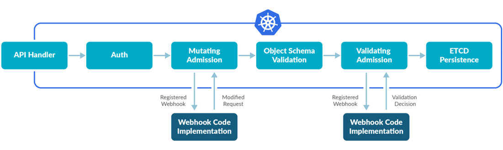

# 🛡K8S资源管控功能说明

> 适用于KubeDoor 2.x。

KubeDoor基于K8S Mutating Webhook（准入控制），在Deployment创建、发布、扩缩容时，把微服务的**Pod数、需求值（requests）、限制值（limits）**，以及Java服务的**JVM启动参数**，强制改成管控表里的值。

- **部署完成后默认不开启**，在Web「Agent管理」页按集群、按命名空间开启。
- 管控表在「高峰资源」→「高峰资源管控」页查看和维护，需求值来自每日高峰时段的真实用量。
- 未登记的新服务可以拦截（部署失败并通知），也可以设置为放行。
- 每次改写、拒绝都会发IM通知（agent本身不可达时除外）。

## 🎯为什么要管控

目标是让每个微服务的**需求值与高峰期真实用量保持一致**：

- **调度更准**：K8S调度器按需求值把Pod调度到节点上，需求值真实才能避免资源碎片，实现节点的资源均衡。
- **扩缩容更准**：K8S自动扩缩容（HPA）按需求值计算资源使用率，真实的需求值能更精准地触发扩缩容。（注意：管控命名空间里副本数以管控表为准，HPA的调整会被改回，见「各类变更的处理结果」。）
- **QoS更合理**：节点资源紧张时，K8S优先驱逐用量超出需求值的Pod，需求值真实的Pod会被优先保留，保证关键服务正常运行。

## ⚙️工作原理

<div align="center">

**K8S准入控制逻辑**



</div>

KubeDoor用的是其中的Mutating Admission（变更准入）这一步：

```
kubectl / 发布系统 / KubeDoor / HPA
   │ 创建、更新 Deployment，或修改 deployments/scale
   ▼
kube-apiserver
   │ MutatingWebhook：kubedoor-admis-configuration（超时 30 秒）
   ▼
kubedoor-agent（本集群 kubedoor 命名空间）
   │ WebSocket
   ▼
kubedoor-master ──▶ PostgreSQL：该命名空间是否管控？该服务的管控值是多少？
   │
   ▼
kubedoor-agent ──▶ 回复 kube-apiserver：放行并改写（JSONPatch），或拒绝并附原因；同时发 IM 通知
```

- master查库带5秒超时，结果缓存60秒；在Web上改开关、改管控表、采集完成后会立即清空缓存（直接改数据库最长60秒后生效）。
- master和PostgreSQL是所有集群共用的，它们出故障会影响所有开启了准入控制的集群，见「可用性与应急」。

## 🔛开启与关闭

### 开启前建议

1. 在「Agent管理」确认该集群「状态」为「在线」。
2. 打开「自动采集」并填好「高峰时段」，点「采集」，再到「高峰资源管控」页检查数据，尤其是「限制CPUm」「限制内存M」（-1为未配置），见「管控表的数据从哪来」。
3. 想好未登记服务怎么处理（「新服务免确认」），见「未管控的服务」。
4. 依赖HPA自动扩缩的服务，所在命名空间不要勾选为管控命名空间。
5. 先看一遍「可用性与应急」，准备好应急命令。

### 开启

1. 进入「Agent管理」，打开该集群的「准入控制」开关。
2. 在弹出的「准入控制」窗口，从「命名空间」下拉框多选要管控的命名空间（已排除`kube-system`、`kubedoor`），点「确认」。不选会提示「请输入命名空间」。
3. 成功后「管控命名空间」列显示所选命名空间，例如`["demo","prod"]`。

agent会自动完成：

- 创建`MutatingWebhookConfiguration`：`kubedoor-admis-configuration`；
- 给`kube-system`、`kubedoor`两个命名空间打标签`kubedoor-ignore=true`，这两个命名空间里的变更不拦截（系统组件和KubeDoor自身不受影响）。

开启只影响之后的变更，已在运行的Pod不会被立即修改。建议开启后确认：

```bash
kubectl get mutatingwebhookconfiguration kubedoor-admis-configuration
kubectl get ns -L kubedoor-ignore
```

### 关闭

把「准入控制」拨回关闭，在提示「确认关闭 <集群> 的准入控制功能吗？」中点「确认」：agent删除webhook配置并去掉上面两个命名空间的`kubedoor-ignore`标签，「管控命名空间」清空。

### 说明

- 开关和管控命名空间**只能在Web上操作**。旧版文档里用`kubectl apply`外部YAML开启的方式已废弃，请勿使用（不会写入KubeDoor数据库，管控不会生效）。
- **修改管控命名空间**：页面没有单独的编辑入口，需要先关闭再开启、重新勾选（关闭期间不拦截）。
- 以上操作需要读写账号，只读账号会被拒绝（403）。
- 「新服务免确认」要先开启「准入控制」才能操作。
- 「固定节点均衡」是实验功能，开关已禁用，页面提示「【固定节点均衡】模式还在内部开发测试阶段，请勿开启！」，本文不展开。

## 🚧拦截范围

拦截分两层：

| 层 | 规则 |
|---|---|
| K8S（webhook） | `apps/v1`的`deployments`和`deployments/scale`的**CREATE、UPDATE**请求；凡是**没有**`kubedoor-ignore`标签的命名空间，都会发给agent |
| KubeDoor（master） | 只有「管控命名空间」里的才会改写或拒绝；其它命名空间直接放行，但每次都会发一条「非管控命名空间，直接放行」通知 |

不拦截：删除操作；StatefulSet、DaemonSet、Job、CronJob、单独创建的Pod；Pod被删除后由ReplicaSet自动补建；带`kubedoor-ignore`标签的命名空间。

不需要管控的命名空间，可以让它完全不经过webhook（不再收到通知，也不受KubeDoor故障影响）：

```bash
kubectl label namespace <ns> kubedoor-ignore=true   # 豁免
kubectl label namespace <ns> kubedoor-ignore-       # 取消豁免
```

## 🚩各类变更的处理结果

前提：命名空间已勾选为管控，且该服务在管控表中。

| 你的操作 | 常见来源 | 准入结果 | 滚动重启 |
|---|---|---|---|
| 新建Deployment | `kubectl apply/create`、发布系统首次发布 | 副本数、第一个容器的需求值/限制值、JVM参数全部改为管控值，其余按你的 | 新建 |
| 修改Pod模板（镜像、环境变量、启动参数、资源、重启注解等） | 发布系统、`kubectl set image`、`kubectl rollout restart/undo`、KubeDoor「重启」「更新」（更新镜像）「保存并重启」 | 同上，并与你的其它修改合并；你改的需求值/限制值会被管控值覆盖（管控表里未配置的项除外） | 会 |
| 经scale子资源改副本数 | `kubectl scale`、HPA、KubeDoor「扩缩容」、AI助手发起的扩缩容 | **只把副本数改为管控值**，其它不变 | 不会 |
| 直接改Deployment的`spec.replicas`，Pod模板不变 | `kubectl edit`、只改replicas的`kubectl apply/patch` | **按你的值放行**，不改写；下次发布或重启时恢复为管控值 | 不会 |
| Pod模板和副本数都没变 | 只改Deployment自身的labels/annotations、`kubectl rollout pause/resume` | 原样放行 | 不会 |
| KubeDoor「临时扩容」 | 见「临时扩容豁免」 | 5分钟内直接放行 | 不会 |

要点：

- `kubectl scale`会显示scaled，但实际副本数是管控值。要长期改变副本数，请修改「指定Pod」：Deployment页的「扩缩容」（不勾「临时扩容」）会先把目标副本数写入「指定Pod」再扩缩容；也可以在「高峰资源管控」页的「配置」里修改。
- **HPA与管控冲突**：HPA也是通过scale子资源调整副本，在管控命名空间里每次都会被改回管控值（并且每次都发通知）。需要HPA的服务不要放在管控命名空间里。
- AI助手发起的扩缩容不会写「指定Pod」，在管控命名空间里同样会被改回（做过临时扩容后的第一次除外，见「临时扩容豁免」），需要先修改「指定Pod」。
- 命名空间没有勾选为管控时一律放行、不改写；服务不在管控表时的处理见「未管控的服务」。

## 🧮取值规则

| 项 | 取值 |
|---|---|
| 副本数 | 「指定Pod」≥0时用它；否则「AI推荐」≥0时用它；否则用「当日Pod」 |
| 需求CPU | 「需求CPUm」写成`<值>m`；库里为0~9时按`10m` |
| 需求内存 | 「需求内存M」写成`<值>Mi`；库里为0时按`1Mi` |
| 限制CPU | 「限制CPUm」写成`<值>m` |
| 限制内存 | 「限制内存M」写成`<值>Mi` |

- 未配置的项（需求值为负数、限制值≤0，页面上为-1）不修改原值，并发通知「未配置 request_cpu_m」等。
- 「指定Pod」=0是合法值，会把服务缩到0（发布服务但暂不启动Pod）；-1表示不指定，只有采集过高峰期数据的服务才能设为-1（手动新增、还没采集过的服务「当日Pod」为0，-1会退回成0副本，页面和接口都会拒绝）。
- 「AI推荐」列默认隐藏，目前没有功能写入该值（恒为-1），所以实际顺序就是「指定Pod」→「当日Pod」。
- 只改Deployment模板里的**第一个容器**（`containers[0]`），其它容器（含sidecar）和initContainers不变，多容器的服务请把业务容器放在第一个。resources里的其它项（如`ephemeral-storage`、GPU）保留。
- 改写后需求值不能大于限制值，否则K8S会拒绝这次变更（例如把「限制CPUm」改得比「需求CPUm」还小）。遇到时在「配置」里调大限制值。
- 「高峰资源管控」页的「批量扩缩容」「保存并扩缩容」按同样的优先级计算目标副本数。

## ☕JVM启动参数管控（2.x新增）

与资源管控走同一次准入：**新建Deployment或修改Pod模板**时，同时按管控表替换第一个容器`args`里的JVM参数；scale不改args。

| 项 | 说明 |
|---|---|
| 管控参数 | `-Xms`、`-Xmx`、`-Xss`、`-XX:MaxMetaspaceSize=`（页面列Xms、Xmx、Xss、MaxMeta，Xss单位k，其余单位m，未采集显示`-`） |
| 识别条件 | 只看第一个容器的`args`，且`args[0]`必须是`java`；`-jar`、主类之后的应用参数不处理。`command`里的java、`sh -c "java …"`、`JAVA_OPTS`等环境变量、启动脚本都不支持 |
| 替换方式 | 只替换args里**已存在**的同名参数（出现多次全部替换），不新增缺失的参数；未采集的项不动 |
| 数据来源 | 每次「采集」更新管控表后，自动读取各Deployment当前的启动参数（需要agent在线），只补管控表里还为空的项，已有值不覆盖 |
| 修改 | 「配置」里只能修改已采集的项，保存后在下次发布或重启时生效；Xms不能大于Xmx |

⚠️**库值优先**：某服务的JVM参数一旦入库，发布清单里改的`-Xmx`等在发布时就会被改回库里的值。要调整JVM参数，请在「配置」里修改。

「P95podHeap%」「P95podG1E%」是堆内存、G1 Eden的高峰使用率，**只展示**，不会自动修改Xms/Xmx。

详见[JVM启动参数采集与管控](../docs/jvm-resource-control.md)。

## 📊管控表的数据从哪来

页面：「高峰资源」→「高峰资源管控」。

| 列 | 来源 | 采集时更新 |
|---|---|---|
| 当日Pod | 选定日高峰时段内Running且Ready的Pod数最小值 | 是 |
| 指定Pod | 人工指定；手动新增时必填（≥0），采集自动入表时为-1 | 否 |
| P80PodCPU%、P80Pod内存% | 选定日高峰时段CPU、内存（WSS）相对限制值的使用率P80 | 是 |
| 需求CPUm、需求内存M | 选定日高峰时段CPU、内存（WSS）用量的P80（每个Pod取用量最大的容器，再对服务内各Pod取平均） | 是（「配置」里不可改） |
| 限制CPUm、限制内存M | 服务**首次**进入管控表时观测到的限制值 | 否（之后在「配置」里人工维护） |
| P95podHeap%、P95podG1E% | 堆内存、G1 Eden使用率的高峰P95，只展示 | 是 |
| Xms、Xmx、Xss、MaxMeta | 采集到的JVM启动参数 | 只补空值 |

- **选定日**＝最近10天里**整个集群**CPU总消耗最大的那一天（不是每个服务各自最忙的一天）。页面横幅原文：「标红字段来自最近10天最大资源使用日(…)的高峰数据。CPU、内存采用P80，堆内存和G1 Eden Space使用率采用P95；CPU/内存用量用于计算需求值，堆内存和G1 Eden Space使用率仅展示。(-1为未配置，-为无JVM使用率数据)」
- **开启采集**：「Agent管理」打开「自动采集」，在「开启自动采集」窗口填「高峰时段」（格式`HH:MM:SS-HH:MM:SS`，默认`10:00:00-11:30:00`，按北京时间）。之后「采集」按钮才可用，点它在「采集历史数据」窗口设置「采集天数」（默认10，范围1~90）补采历史数据。
- **每日自动采集**：CronJob`kubedoor-collect`每天北京时间01:00对所有开启「自动采集」的集群采集前一天的高峰数据，然后重新选定最大日、更新管控表。
- 重复采集不会重复写入。新出现的服务会自动加入管控表，见「未管控的服务」。
- 数据来自时序库：需要该集群的kube-state-metrics、cAdvisor指标带集群标签（`PROM_K8S_TAG_KEY`=`K8S_NAME`）。

### 修改管控值

- 行内「配置」：可以改「指定Pod」「限制CPUm」「限制内存M」和已采集的JVM参数；「需求CPUm」「需求内存M」来自采集，不能改。
- 「配置」窗口的按钮：「保存并扩缩容」「保存并重启」「保存」「取消」。只「保存」时改动只写入数据库（窗口提示「⚠️需求值与限制值的调整，仅在[开启管控]后执行重启时才会应用到微服务，否则改动仅会写入数据库。」），下次发布或重启时才应用；删除Pod让它重建不会生效。
- 勾选多行可以「批量扩缩容」「批量重启」：勾选多个服务时立即依次执行，可设「间隔时间」（秒）；只勾选一个服务时（以及「保存并扩缩容」「保存并重启」）可选执行类型「立即执行」「定时执行」「周期执行」。
- 也可以让AI助手修改（需要在Web上批准），同样在下次发布或重启时生效，见[AI助手说明](../docs/ai-assistant.md)。

## 🆕未管控的服务

「未管控」＝管控表里没有该集群、命名空间、Deployment名对应的记录。

| 「新服务免确认」 | 准入结果 |
|---|---|
| 关闭（默认） | **拒绝**创建、发布和扩缩容，通知「…部署失败: k8s_res_control表中找不到该服务，且未开启新服务免确认，请先新增服务。」 |
| 开启 | 放行，不改写，通知「master(admis)返回: 新服务免确认已启用…该服务不会被管控…」 |

纳入管控的方式：

1. **手动登记**：「高峰资源管控」页点「新增资源」，填「K8S」（与该集群的`K8S_NAME`一致）、「命名空间」、「微服务」（Deployment名）、「指定Pod」、「需求CPUm」、「限制CPUm」、「需求内存M」、「限制内存M」，点「保存」。下拉框里没有的值可以直接输入。
2. **采集自动入表**：每次采集后，选定日数据里有、管控表里没有的服务会自动加入（「指定Pod」为-1，需求值为P80用量，限制值为当时的实际值），并通知「采集高峰期数据更新到管控表时，检测到新服务【…】【…】【…】,将新增到管控表。」（该集群第一次采集时整批写入，不逐个通知）。所以「新服务免确认」+「自动采集」时，新服务要等它出现在选定日的数据里（最晚约10天）才会自动纳入管控；想立即管控请手动登记。

> ⚠️**「新增资源」时「指定Pod」必须填写（≥0，0表示发布但暂不启动Pod），不能为-1。**
> -1会退回到「当日Pod」，而手动登记的服务在采集到数据之前「当日Pod」为0，准入会把副本数改成**0**。所以新增时页面和接口都不接受-1；编辑（「配置」）时也只有采集过高峰期数据的服务才能把「指定Pod」设为-1。

## ⏱临时扩容豁免

- 入口：Deployment页「操作」→「扩缩容」，在「微服务扩缩容」窗口勾选「临时扩容」；或展开Deployment的Pod明细，「隔离」时勾选「临时扩容1个Pod」。
- KubeDoor会给Deployment写注解`scale.temp`（格式`时间@原副本数-->新副本数`）并直接修改副本数。准入看到**5分钟内**的`scale.temp`、且这次只改副本数时直接放行，不查管控表，也不发准入通知。
- 临时扩容**不写**「指定Pod」，之后的发布、重启或经scale子资源的扩缩容都会恢复为管控值。
- 临时扩容留下的`scale.temp`注解会在下一次非临时的KubeDoor扩缩容（含AI助手、定时/周期任务发起的）时被清除；这一次KubeDoor直接修改Deployment、不经scale子资源，准入按「直接改`spec.replicas`」处理，按请求的副本数放行。
- 只对「立即执行」有效：选「定时执行」「周期执行」时，到点后按普通扩缩容处理，在管控命名空间里会被改成管控值。

## 🔔通知

准入相关通知由该集群的agent用它自己的机器人配置发送（安装agent时`kubedoor.conf`里的`MSG_TYPE`、`MSG_TOKEN`），前缀为`admis:【集群】【命名空间】【Deployment】`：

| 通知内容 | 含义 |
|---|---|
| 收到 create 请求，修改所有参数／收到 update 请求，修改所有参数（附「副本数:…, 请求CPU:…m, 请求内存:…MB, 限制CPU:…m, 限制内存:…MB」和「固定节点均衡: False」） | 新建或Pod模板变更，已按管控值改写 |
| 收到scale请求，仅修改replicas为: N | scale子资源扩缩容，副本数改为N |
| 不符合预设判断条件: Deployment UPDATE，直接放行 | 只改了`spec.replicas`，按你的值放行 |
| 未配置 request_cpu_m（或request_mem_mb、limit_cpu_m、limit_mem_mb） | 该项未配置，保留原值 |
| 非管控命名空间，直接放行 | 命名空间没有勾选管控（每次变更都会发） |
| master(admis)返回: 新服务免确认已启用… | 未登记的服务被放行 |
| master(admis)返回:…部署失败: …请先新增服务。 | 未登记的服务被拒绝 |
| 连接 kubedoor-master 失败／连接 kubedoor-master 响应超时／查询数据库异常／master 处理 admis 请求异常 | KubeDoor链路故障，请求被拒绝 |
| 处理错误：<异常> | agent处理出错，请求被拒绝 |

- KubeDoor扩缩容后的通知「… has been scaled! 原副本数 --> 目标副本数」显示的是请求的目标数，管控命名空间里实际副本数以准入结果为准。
- 带server-side dry-run的请求（如`kubectl apply --dry-run=server`、AI助手执行写操作前的预检）也会经过准入并发通知。
- 采集时自动入表的新服务通知由master的机器人发送。

## 🚨可用性与应急

准入控制是**fail-closed**的：webhook的`failurePolicy`为`Fail`，agent只有1个副本，而且每次判断都要经过agent→master（缓存未命中时还要查PostgreSQL）。下面任一情况发生时，**所有没有`kubedoor-ignore`标签的命名空间**（不只是管控命名空间）里的Deployment创建、发布、扩缩容都会被拒绝：

| 故障 | kubectl报错中可以看到 |
|---|---|
| agent不可用或不可达 | `failed calling webhook "kubedoor-admis.mutating.webhook"` |
| agent与master断开（如master重启、升级） | `denied the request: 连接 kubedoor-master 失败` |
| master 30秒内没有响应 | `denied the request: 等待 kubedoor-master 响应超时`，或webhook调用超时 |
| 数据库查询失败 | `denied the request: 查询数据库异常` |

唯一的例外是5分钟内的KubeDoor「临时扩容」（不经过master）。

**应急处理**：

```bash
# 立即解除所有拦截（删除webhook配置）
kubectl delete mutatingwebhookconfiguration kubedoor-admis-configuration

# 只放过某个命名空间
kubectl label namespace <ns> kubedoor-ignore=true

# 排查
kubectl get mutatingwebhookconfiguration kubedoor-admis-configuration
kubectl get ns -L kubedoor-ignore
kubectl -n kubedoor logs deploy/kubedoor-agent | grep admis
```

用kubectl删除webhook配置后，Web上「准入控制」仍显示开启。KubeDoor恢复后，在Web上把它拨到关闭（会提示「Webhook is already closed!」）同步状态，需要时再重新开启。

**注意事项**：

- **卸载或重装agent前，先在Web上关闭该集群的「准入控制」。** `./install.sh uninstall agent`不会删除webhook配置，残留的配置指向已不存在的agent，会拒绝该集群里所有Deployment变更（带`kubedoor-ignore`标签的命名空间除外；此时用上面的delete命令清理）。安装与卸载见[部署文档](../deploy/README.md)。
- **`kubedoor.conf`里的`NAMESPACE`必须保持`kubedoor`。** webhook配置里写死了`kubedoor`命名空间下的`kubedoor-agent`服务，装在其它命名空间时，开启准入会拒绝集群内所有Deployment变更（带`kubedoor-ignore`标签的命名空间除外）。
- 升级、重启master或agent期间会有短暂的拒绝窗口，建议避开发布时段，或先关闭准入控制。

## 🌰管控例子

假设集群`prod-a`的命名空间`demo`已开启管控，服务`deploy-demo-api`在管控表中：指定Pod=4，需求CPUm=500，限制CPUm=2000，需求内存M=1024，限制内存M=2048。

1. **kubectl扩容**：执行`kubectl -n demo scale deploy/deploy-demo-api --replicas=10`，命令显示scaled，实际副本数被改为**4**，通知「收到scale请求，仅修改replicas为: 4」。正确做法：在Deployment页「扩缩容」把「指定Pod」调到10（会写入管控表）；短时扩容用「临时扩容」。
2. **kubectl edit改副本**：只把`spec.replicas`改为10，按10放行，通知「不符合预设判断条件: Deployment UPDATE，直接放行」；下一次发布或重启时恢复为4。
3. **发布新镜像**：发布系统修改镜像后，新镜像保留，副本数改为4，第一个容器的requests改为`cpu: 500m`、`memory: 1024Mi`，limits改为`cpu: 2000m`、`memory: 2048Mi`；如果已采集JVM参数，`-Xmx`等也改为库里的值。通知「收到 update 请求，修改所有参数」，并附「副本数:4, 请求CPU:500m, 请求内存:1024MB, 限制CPU:2000m, 限制内存:2048MB」。
4. **未登记的新服务**：「新服务免确认」关闭时，`kubectl apply`新服务`deploy-demo-new`失败，报错中包含：

   ```
   admission webhook "kubedoor-admis.mutating.webhook" denied the request: master(admis)返回:【prod-a】【demo】【deploy-demo-new】部署失败: k8s_res_control表中找不到该服务，且未开启新服务免确认，请先新增服务。
   ```

   先在「高峰资源管控」页「新增资源」登记（「指定Pod」填期望副本数），或打开「新服务免确认」。

## ❓常见问题

| 现象 | 原因与处理 |
|---|---|
| 发布报「…请先新增服务。」 | 服务未登记且「新服务免确认」关闭，见「未管控的服务」 |
| `kubectl scale`或HPA设置的副本数被改回 | 副本数以管控表为准，修改「指定Pod」或用「临时扩容」 |
| 在「配置」里改了，Pod没变 | 只写入了数据库，「保存并重启」或下次发布才会应用 |
| 发布清单里改的`-Xmx`被改回 | 库里的JVM参数优先，在「配置」里修改 |
| 新登记的服务被缩到0个副本 | 「指定Pod」填了0，或旧版本新增时填了-1（当前版本已拦截）；在「配置」里改成期望副本数 |
| 非管控命名空间也频繁收到通知 | 给这些命名空间打`kubedoor-ignore=true`标签 |
| 发布报requests不能大于limits | 管控表的限制值小于需求值，在「配置」里调大限制值 |
| 开启后没有拦截 | 用`kubectl get mutatingwebhookconfiguration kubedoor-admis-configuration`确认配置存在，并检查「管控命名空间」 |

更多问题见[常见问题](FAQ.md)。
